Hello :)

In this file, I would like to present my knowledge of Excel in practical activities along with descriptions of what I do specifically. I operate on a database found on the Internet, concerning the sale of bicycles.

I have described each example with a header to make it easier for you to navigate.

---

1. Data cleaning + Grouping + Find and replace + Hiding personal data + absolute reference + converting text to numbers (SUBSTITUTE, LEFT, REPT, LEN)
2. Cell formatting + Sorting + Filtering 
3. Charts, financial and mathematics functions (SUMIFS, TRIM, INDEX + MATCH, SUMPRODUCT, SUM, UNIQUE, XLOOKUP)
4. Pivot tables
5. Financial calculations (Average, conversion to USD, profit, revenue gross/net, cost, average order value, unit cost, profit margin)
6. Power Query (import CSV, text cleanup and transformation, remove duplicates & errors, change data types, fix formatting, extract/format text, column profiling tools, pivot/unpivot table)
7. Excel Table. Web Query, Data Validation, SmartArt, Protect sheet
8. Advanced Data Analysis in Excel (FORECAST.ETS, Linear Regression, Goal Seek, Forecast Sheet, ROW, IFERROR, MODE, KURTOSIS, MEDIAN, SKEW, STDEV.P, RANGE, VARIANCE, PERCENTILE, CORRELATION, T.TEST, ANOVA, NORMAL DIST.)
9. LAMBDA, What - if analysis (LAMBDA MAP / REDUCE / SCAN / BYROW / BYCOL / MAKEARRAY, LET, CHOOSE, MOD)
10. VBA (GIF)

---

The file "Excel Chronicles" is used in the first five chapters.

The "Heroes_csv" file is used in the Power Query chapter.

The "Heroes_stats_csv" file is used in chapters 8 and 9.

For privacy and security reasons, the VBA file is not included, and only .csv files are provided in this repository.

You can click the headers below to go directly to the specific chapters:

# Table of Contents
- [Table of Contents](#table-of-contents)
- [1. Data cleaning + Grouping + Find and replace + Hiding personal data + absolute reference + converting text to numbers](#1-data-cleaning--grouping--find-and-replace--hiding-personal-data--absolute-reference--converting-text-to-numbers)
- [2. Cell formatting + Sorting + Filtering](#2-cell-formatting--sorting--filtering)
- [3. Charts, financial and mathematics functions](#3-charts-financial-and-mathematics-functions)
- [4. Pivot tables](#4-pivot-tables)
- [5. Financial calculations](#5-financial-calculations)
- [6. Power query](#6-power-query)
- [7. Excel Table, Web Query, Data Validation, SmartArt, Protect sheet](#7-excel-table-web-query-data-validation-smartart-protect-sheet)
- [8. Advanced data analysis in excel](#8-advanced-data-analysis-in-excel)
- [9. LAMBDA, What-if analysis](#9-lambda-what-if-analysis)
- [10. VBA](#10-vba)

## **1. Data cleaning + Grouping + Find and replace + Hiding personal data + absolute reference + converting text to numbers** 

1. Duplicates
First select everything CTRL + A and remove duplicates

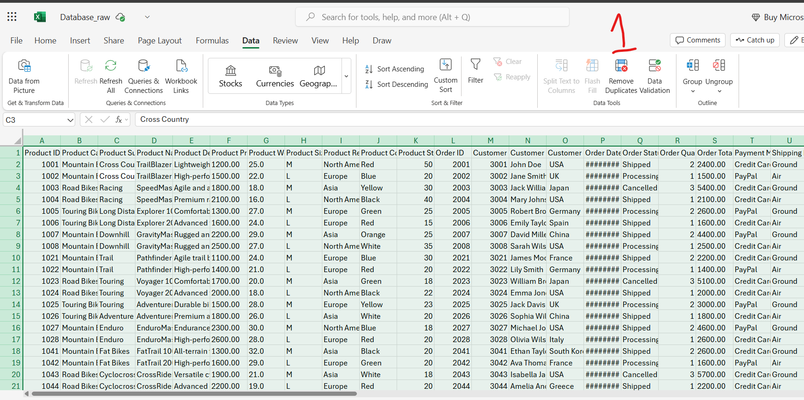

2. Empty cells
- Using "Find and replace" we search for cells to replace
- We can do the same for "spaces", "N/A" errors or any other value that may affect the data analysis

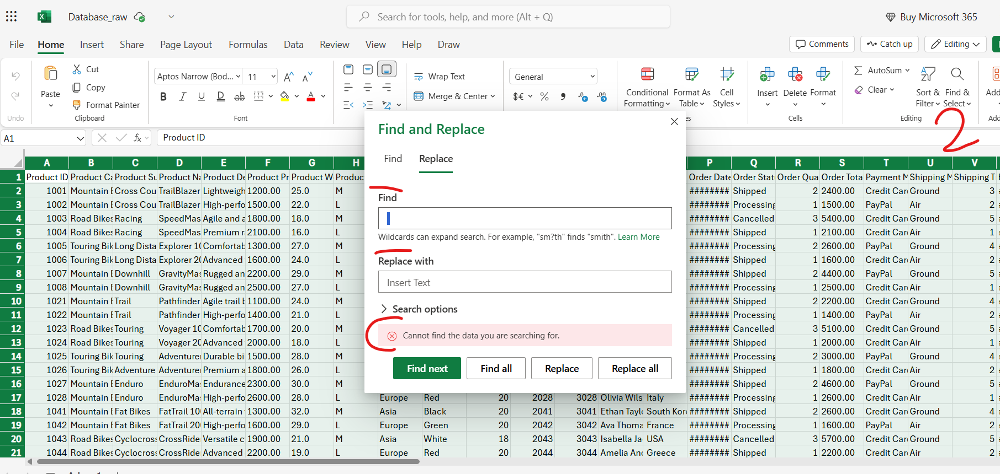

3. Autofit
- For a better view, we can adjust the automatic width and height of the cells, so that the data is more readable and the ####### signs that indicate

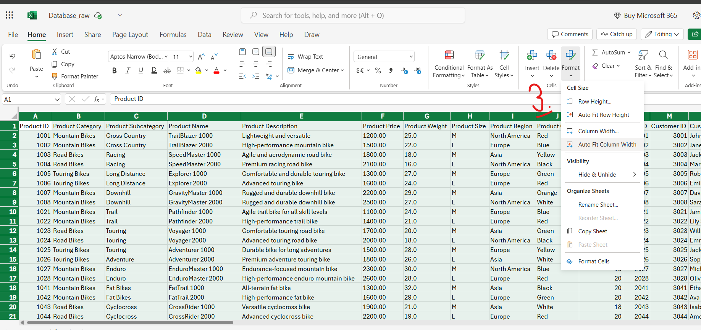

4. Changing text to numbers
- The next thing we should do is add the Euro sign to Product Price, but when we try to do this it turns out that nothing changes. This is because this data is entered as text, not as numbers. One way to convert them to numbers is to change the dot to a comma and then multiply everything by the number "1"
- In this situation, we can use the Substitute function, mark the range of the entire product price column, change the dots in it to a comma, and then multiply everything by 1
- Then we can use flash fill, but remember to add the absolute value ($ symbol) to the cell where our number 1 is, so that it does not move during filling
- The next step is to copy the special "values ​​only" to the Product Price column
- It is very important to paste only the values, because without this code, the formula would be replaced, and then what we did in Substitute would not work correctly
- After pasting, we can easily select the entire cell and change the values ​​to currency. We should do the same with the Product Weight and Order Total columns

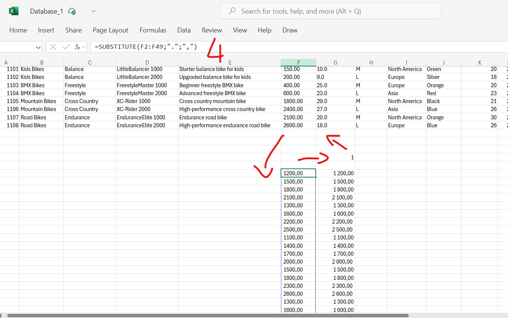

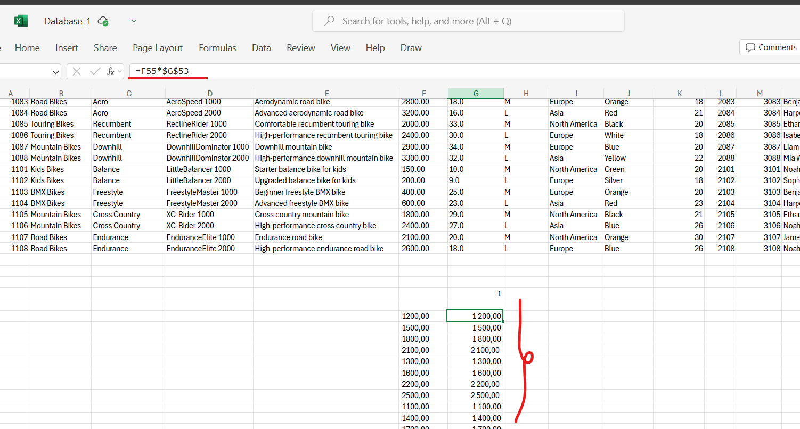

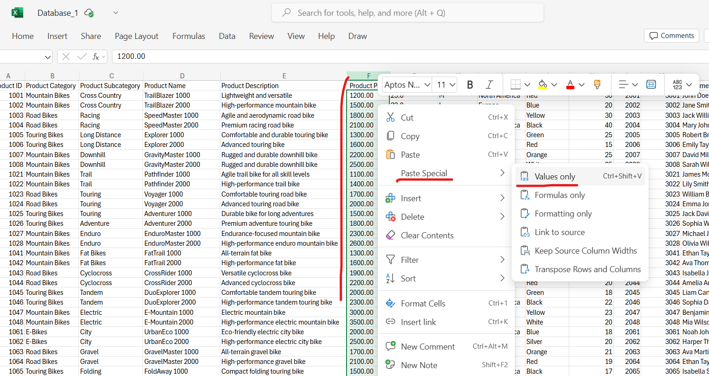

5. Enlarge headers
- For better readability, it is worth bolding the headers, increasing their font and bolding the border, changing the color of the header cells and Product ID for easier searching, which is especially important when working with SQL
- After that, you should re-select everything using ctrl + A and increase the cell width to auto-fit

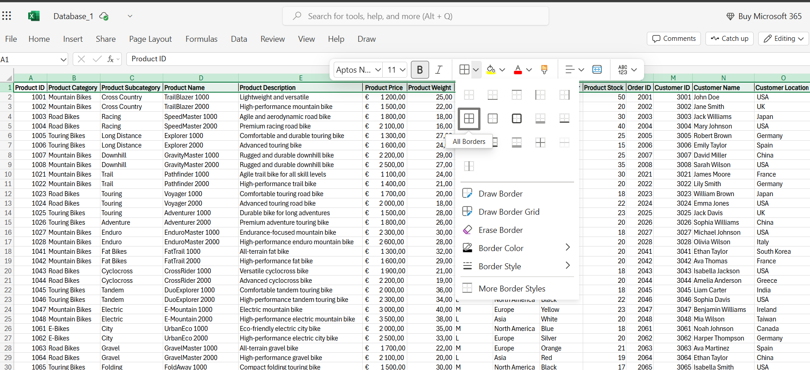

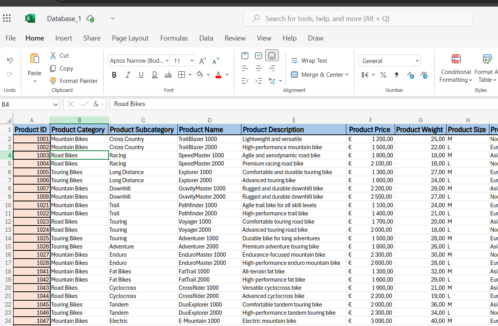

6. Grouping
Another thing worth doing before future analysis is proper grouping to smoothly move around the table. I suggest grouping and thus temporarily covering the columns: Product Subcategory, Product Name, Product Description, Product Size, Product Region, Product Color, Payment Method, Shipping Method.

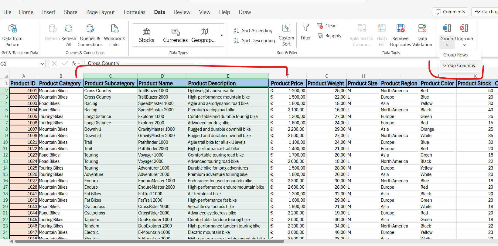

7. Personal data
- The last thing in preparing the data will be to cover the personal data with asterisks, for this purpose we will use a similar code as in the case of conversion to numbers, but we must determine that at least one letter of the name is visible
- The LEFT function will help us with this, which will take the first letter from the name and surname
Then the concatenation icon, i.e. "&", and then REPT from "repeat" so that the remaining letters of the name are also covered. The length is determined by the length of the characters in a given cell -1

[Table of Contents](#table-of-contents)
## **2. Cell formatting + Sorting + Filtering** 

1. Formatting opinions
- First of all, we can refer to opinions, so I suggest formatting the cells so that they have colors assigned to positive, negative and neutral opinions. To do this, select the cell with opinions, and after selecting cell formatting, select the appropriate colors assigned to the opinions.

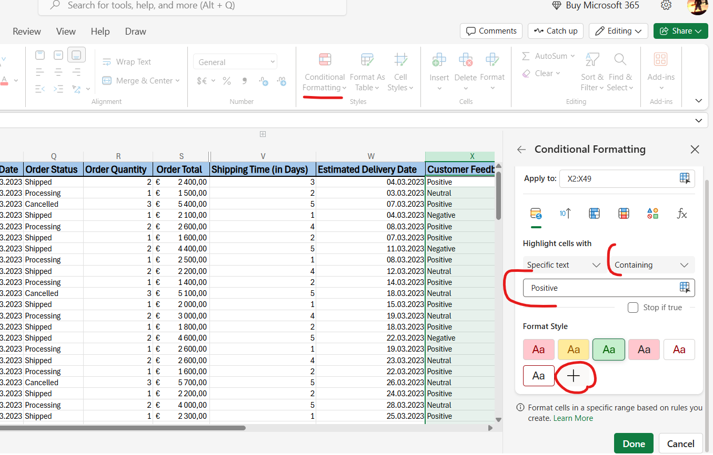

2. Data bars
We can then add chart columns to each cell to visually show which bikes had a price compared to others.

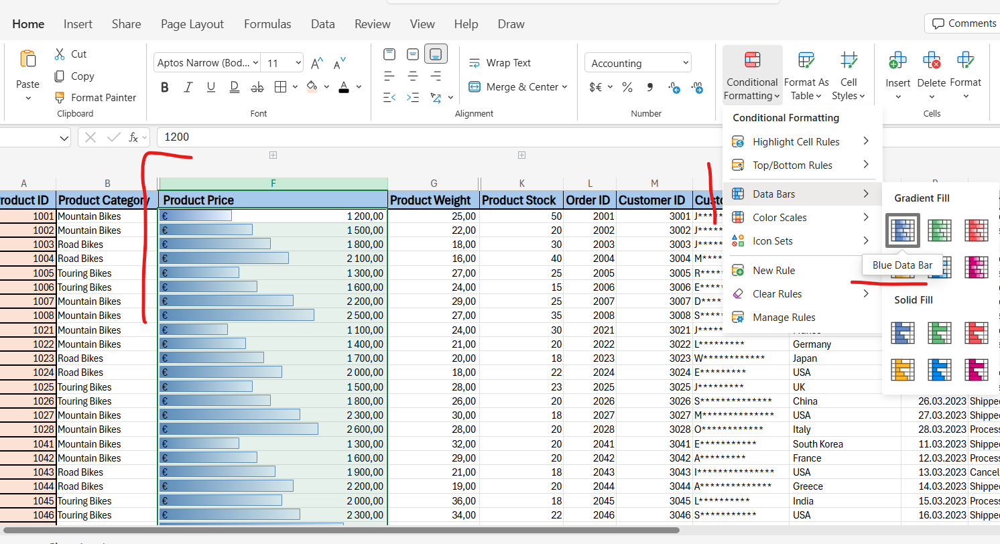

3. Highlight shipment
Now we can further highlight the canceled transactions.

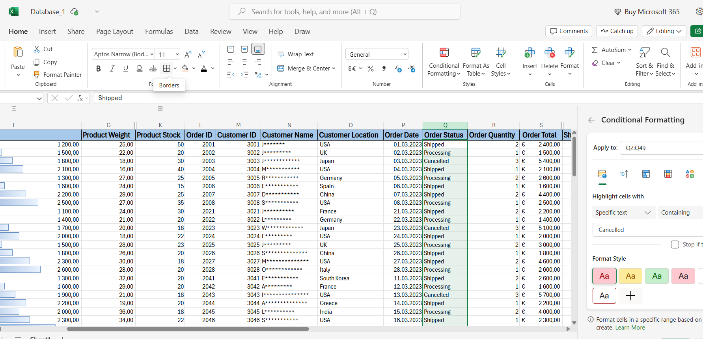

4. Sorting
- Now sorting will be easier, because we can do it based on color, for this purpose, we select the Order Status column, right-click on sorting and choose color and descending order
- Now we can add another sorting condition. I suggest choosing the color of the feedback to check if the cancellation of the shipment was associated with a negative opinion
Adding colors and mini charts is very helpful, thanks to this we can already draw preliminary conclusions from a distance. As you can see, negative opinions were issued to items that were sent correctly. Therefore, other factors must have influenced the cancellation of the order as well as negative opinions. In addition, thanks to the columns assigned to the prices of bicycles, we can see that there is no direct connection between price and opinions / cancellation, because in both categories there were items from every price range.

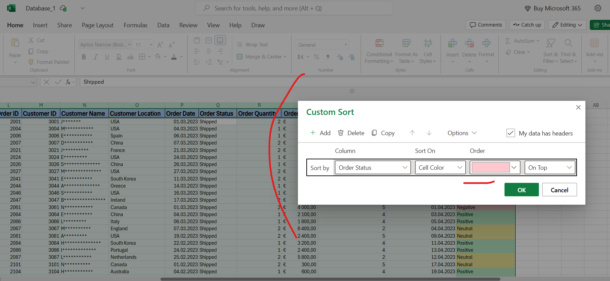

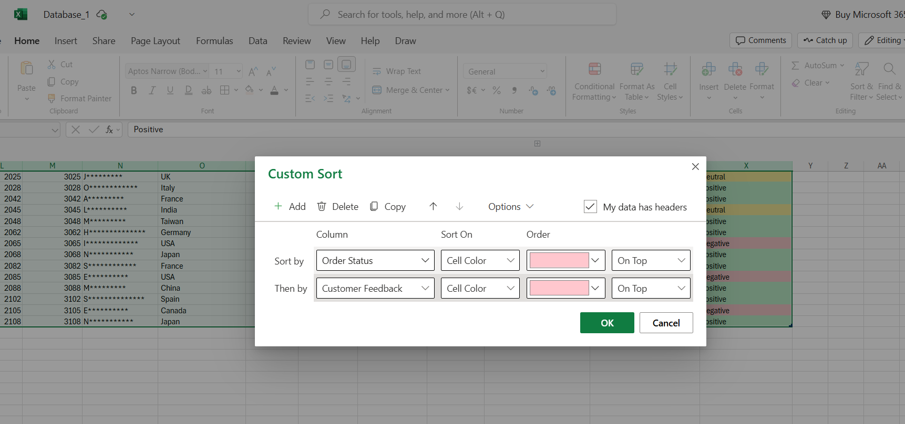

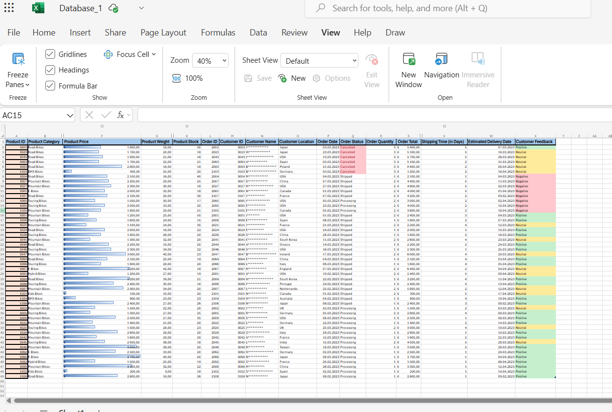

5. Filtering
- Zooming in, we can see that only Road Bikes and BMX are at the top of the canceled bikes, we can use filtering to check if it's just a coincidence, the fact that Road Bikes sell the most, or if it's actually them that's the problem
- To do this, we'll select Product Category and select the filter and Road Bikes
- I also suggest grouping the Product Weight, Product Stock, Order ID, Customer ID and Customer Name columns to make the view more readable
- We can see that Road Bikes actually contains both canceled and positive ones, it would certainly be worth taking a closer look at what is the reason for the cancellation of Road Bikes, in a moment we'll create a chart to see how the number of Road Bikes is distributed compared to other bikes.
- Firstly I suggest sorting the bikes by price to see if price matters here

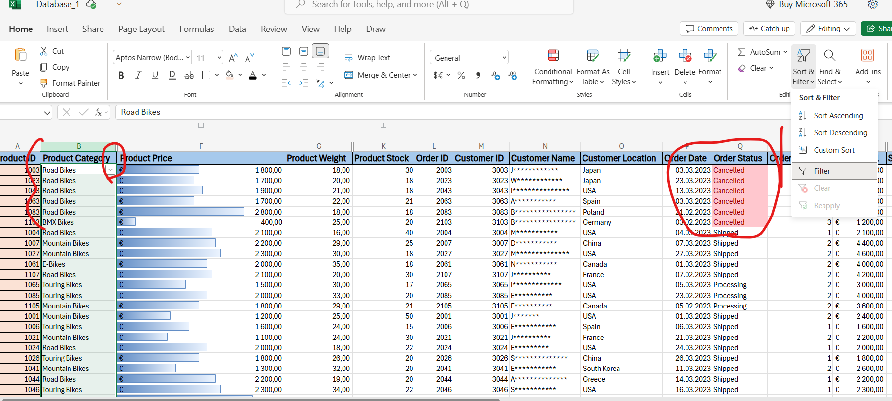

- Now select the filter and Greater than or equal to 2800.00 to extract only the most expensive bikes

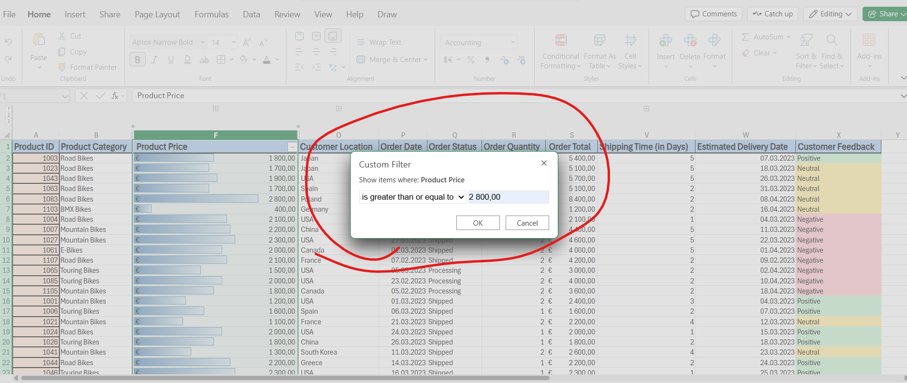

- For this purpose, it will be very useful to extract the Top 10 from the order total column or simply sort descending by order amount. Sorting by number of orders and price ultimately showed that all cancellations, negative and neutral opinions mainly concerned large orders, especially those with 3 ordered bikes.

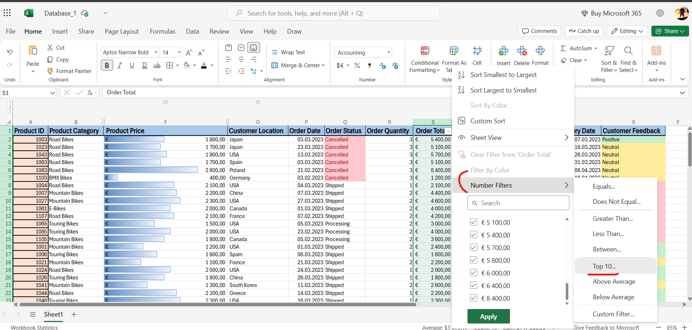

[Table of Contents](#table-of-contents)
## **3. Charts, financial and mathematics functions**

1. Creating an additional table
To simplify our data and create charts, we can create a smaller helper table that will calculate the number of bikes sold to individual countries.
I suggest making such a table under the main table, so that on the left side, the rows are the names of the countries, and the columns are the types of bikes.

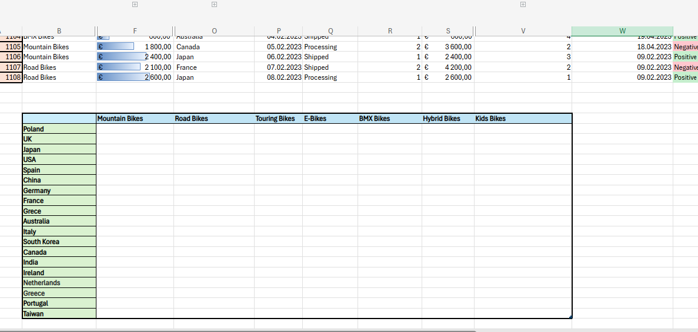

2. Sumifs
Now we can use the sum if function to count how many times items were purchased for each country using specific cells.

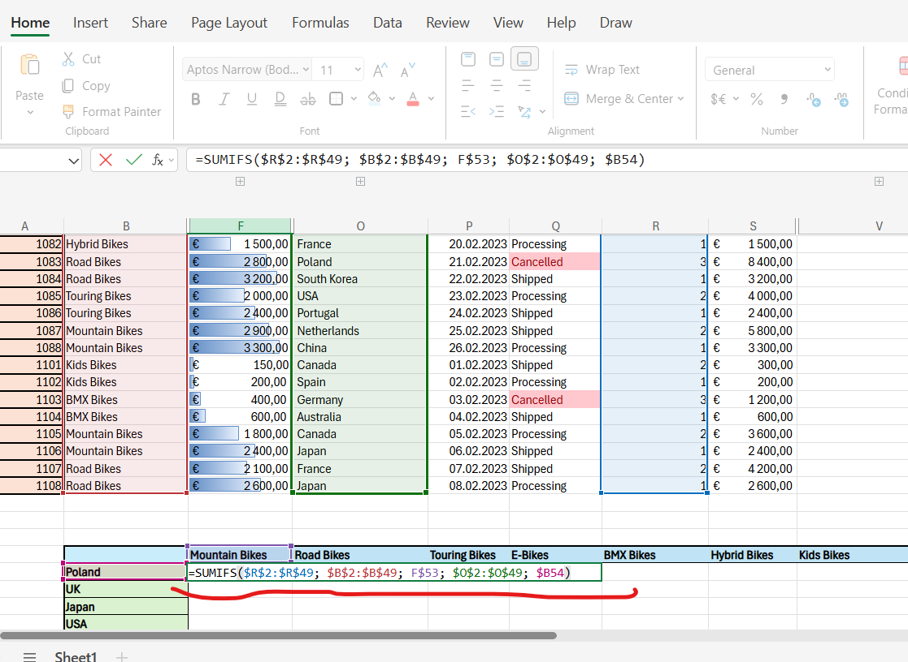

Using flash fill we can drag the function to the entire length of the table.
However, we can see that there must have been an error somewhere, the function is written correctly, yet Road Bikes shows zero. And in the previous steps we determined that the bikes were sent to Poland.

So the error must be somewhere in the cells we use for the equation. When we analyze each of them, we will see that in the country names there is a space before the country name, that's why the code does not work correctly.

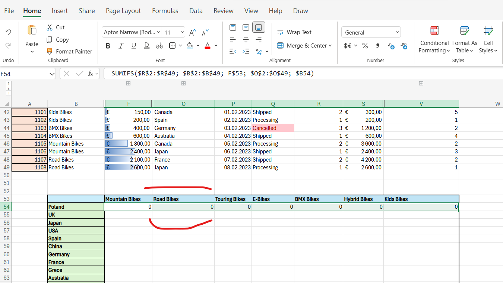

3. TRIM
To get rid of spaces, we can type =TRIM(02), which will effectively remove unnecessary characters. Then we drag down to format all countries in this way and paste only the values ​​in place of the country names.

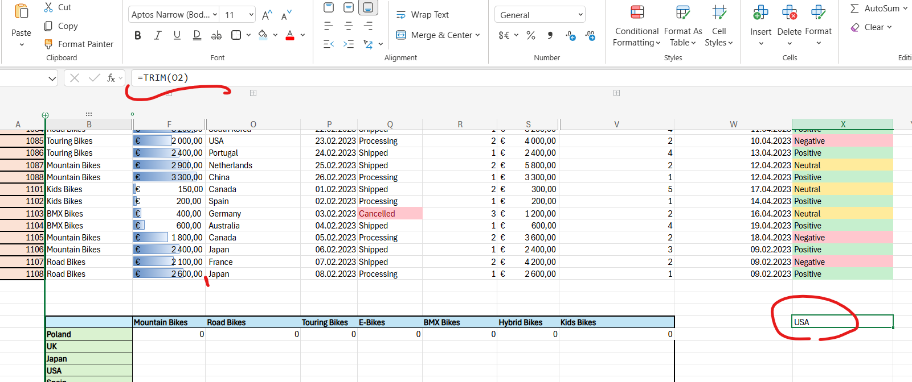

Immediately after copying the countries without spaces, the number 3 appeared in Road Bikes, now we can drag the code to the remaining cells to fill the entire table. It is worth noting that hidden spaces are one of the most common difficulties when working with data.

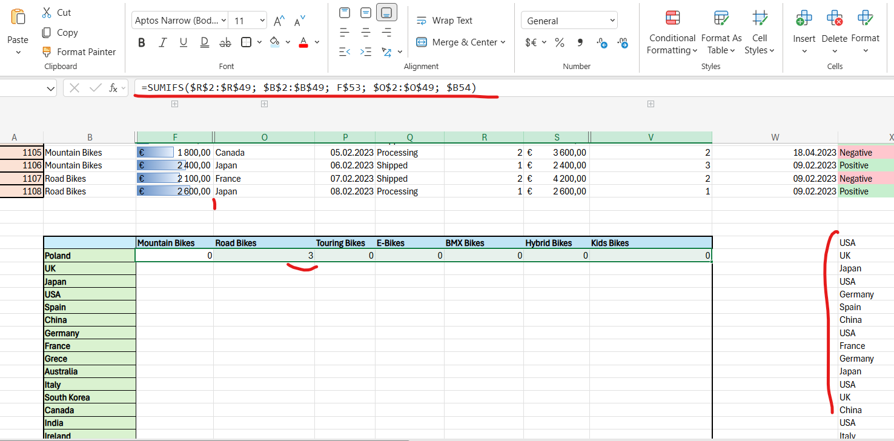

4. SUM
Now it's worth adding the SUM column, which will easily show us in which countries the most bikes are purchased
We can see that the USA is definitely in the lead, while Japan is in second place, and Germany in third.

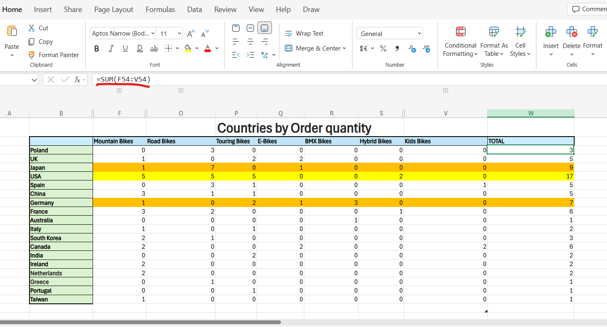

Now we can add the total amount of each type of bike sold at the bottom of the table. By selecting these cells and the cells with the bike types, we create a pie chart to show how the sales of each bike were distributed. 
By selecting the country column and TOTAL, we create a column chart to show more pictorially how the sales results are presented in each country.

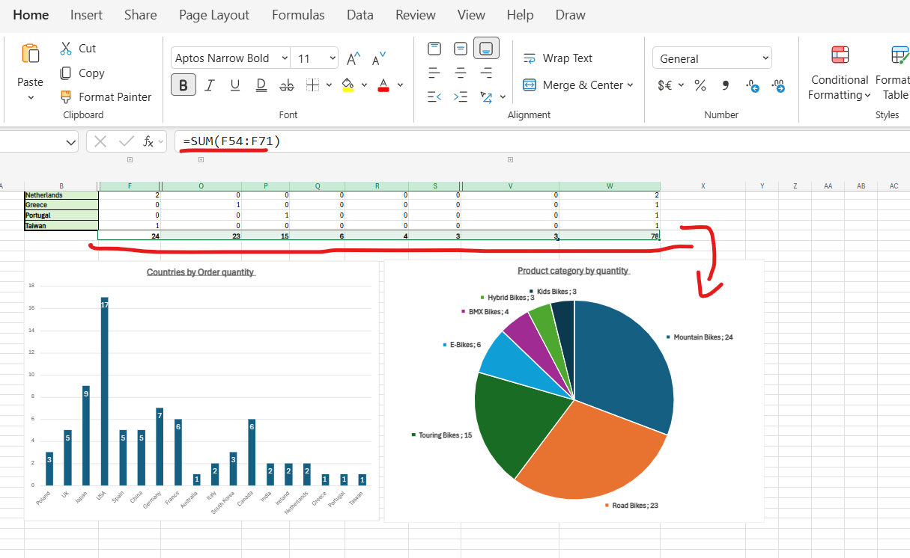

5. UNIQUE + INDEX + MATCH
- Now, using the sum of the product, we can determine what share a particular type of model had in the total sales
To do this, we need to unwind the groups that were created earlier, so that we can see the names of the bikes. We can use the UNIQUE function to quickly copy the entire column and be sure that the records are not repeated. Additionally, if more bike models are added in the future, the list will update.

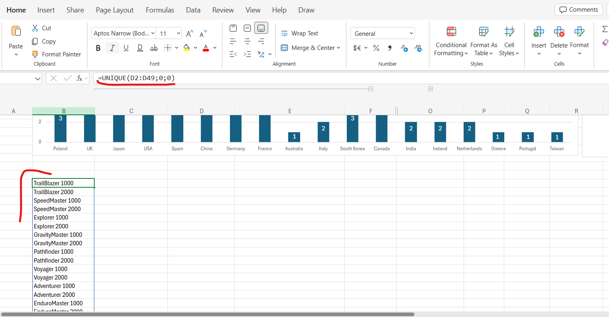

To add a price to individual bikes we can use INDEX + MATCH, thanks to this the price will always stick to a specific model

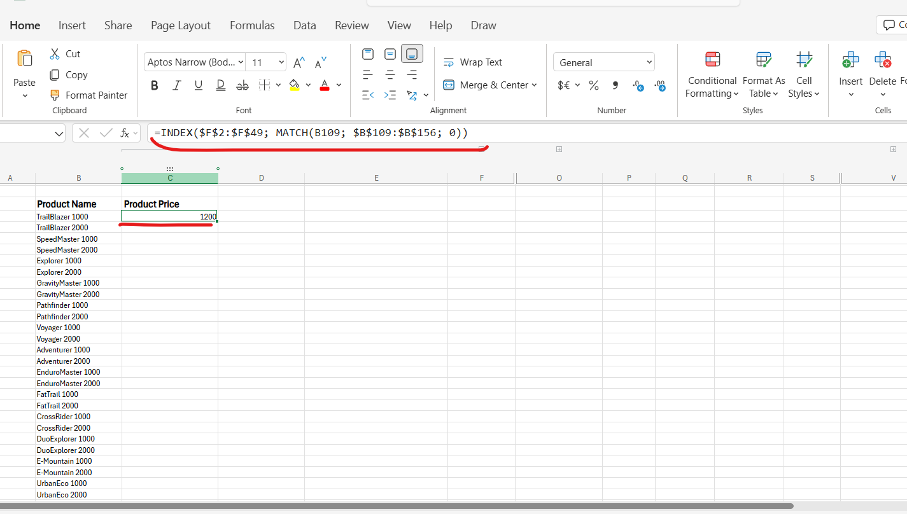)

6. XLOOKUP
To accurately assign a price to each product, especially when the columns are grouped and covered, a good solution would be to use the XLOOKUP function
Thanks to this, we already know what the share of individual bike models is in the sold items, we can now calculate what their share is.

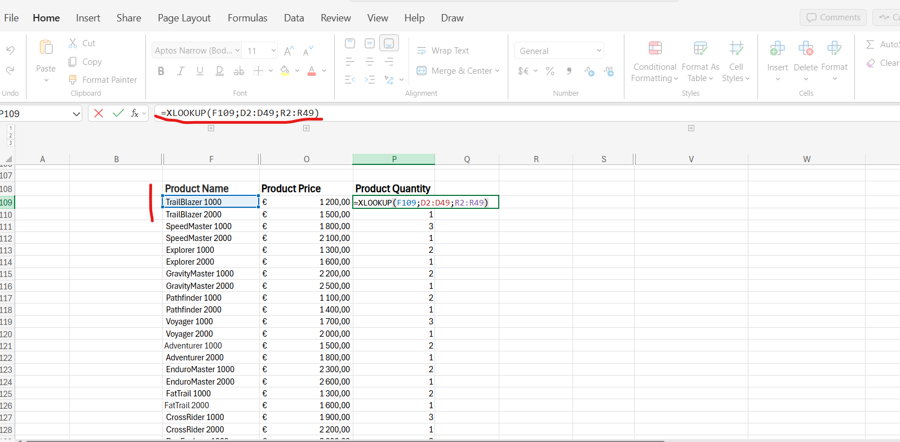

- I calculate the product sum - VERY IMPORTANT - not to use the sum, because then we will only calculate the sum of sold items, which is not the same as revenue
- We calculate the product sum from the price of the product and the quantity sold, which is divided by the price of the SPECIFIC product and its specific quantity, which gives us the division of each product by the total revenue.

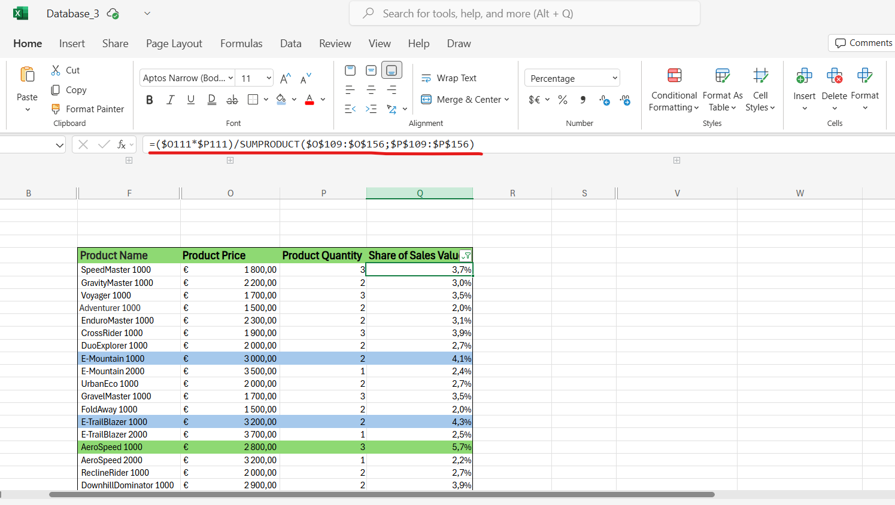

To visually show the proportions, we can use a column chart to show the differences.

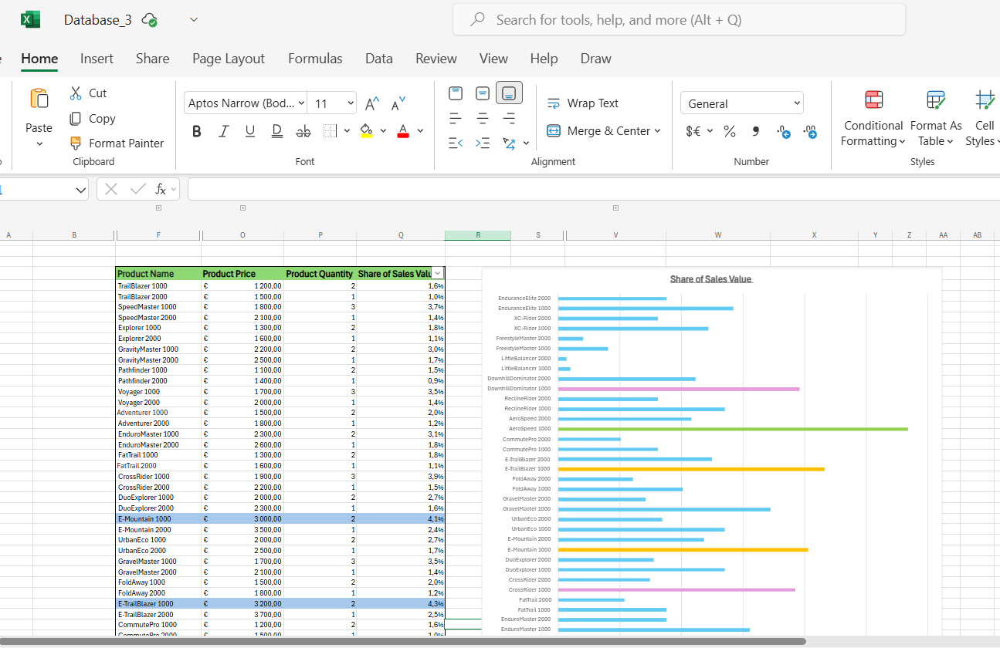

7. Scatter Plot
Because the number of individual models sold is quite small = 1,2,3 subcategories work well to check the sales shares. Which are more detailed than general categories, but less detailed than individual bike models.

I suggest creating a similar table below as the one with product prices. Now, however, we will sum up all the bikes that belong to a given category using the SUMIF function. 

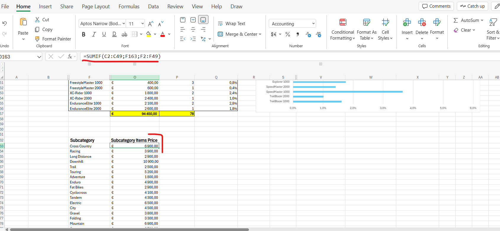

We can calculate the number of sales in subcategories using the same SUMIF function, we change the lookup table to R, which contains the quantity. Thanks to this, we can create a Scatter Plot.

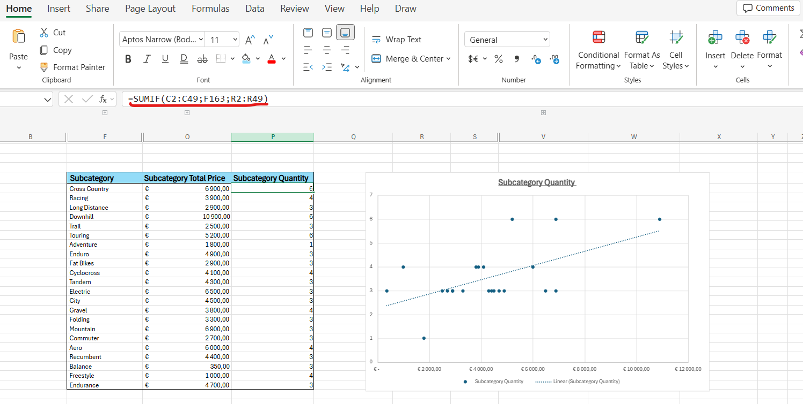

In the graph we can see that the largest quantities of bikes sold = 6 are in both the medium-expensive and the most expensive categories. However, the most visible purchasing pattern is the medium-expensive subcategories 4,000 - 6,500 euros with the quantity between 3 to 4 pieces.

[Table of Contents](#table-of-contents)
## **4. Pivot tables**

A pivot table is a great tool that provides us with important information in a very simple and fast way. The most important thing is to choose the right values ​​in the table.

A pivot table is created by selecting the entire table and choosing "Pivot table", it is best to create it in a new window.

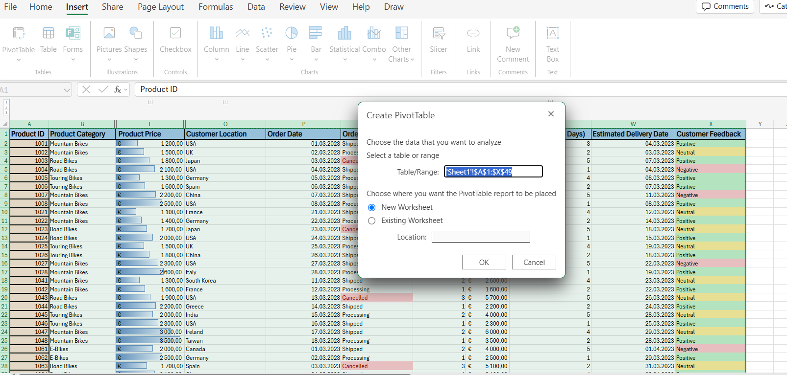

For example, in the table below, I can quickly see how many and which L-size bikes were shipped to Australia over all the days that are counted in the main table

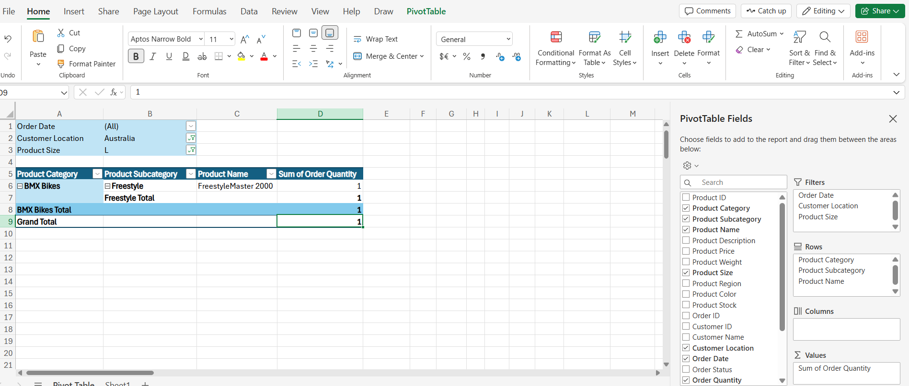

In the same way, we can check how many bikes of a specific color were purchased in a given country. In this example, it is blue for Japan.

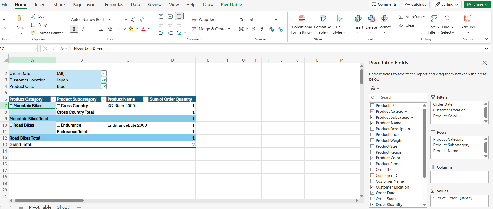

We can also calculate other values ​​than the sum, such as average, min, max, standard deviation, etc. In this example, it shows the average weight of the ordered bike, the biggest advantage of pivot tables is that we get additional information, such as the fact in which country which bike model is chosen.

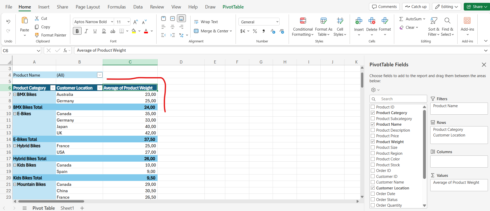

In pivot tables we can use the same field for several areas. In the example below the product category is assigned both as a row and as a value. In the columns is the type of payment, and the location is used as a filter, this gives us very important information in which country and which models of bikes were purchased using PayPal or Credit Card.

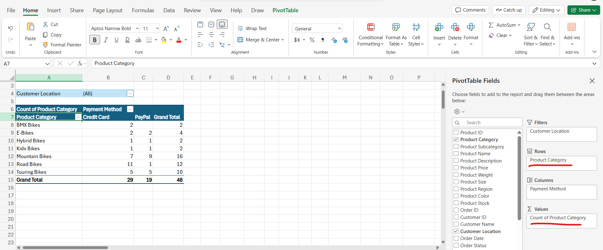

The pivot table refers to the main table, so if we add a new column or row to the main table, the pivot table will not update automatically.
To do this, select the pivot table and choose "Change Data Source", then increase the range of columns / rows from which data is to be retrieved, so that it actually matches the main table. After that, use the "Refresh All" button to update the information.

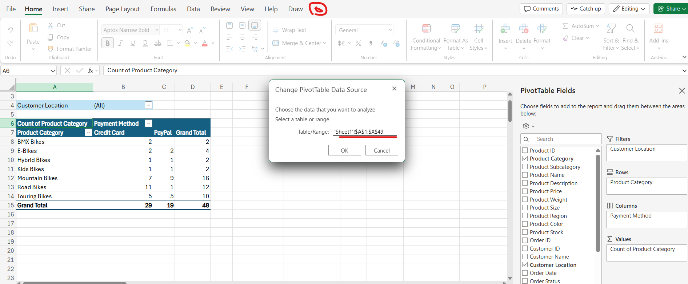

Pivot tables can be formatted in the same way as regular tables, we can also add a slicer to them, which will allow us to select values ​​in the table more dynamically, using a separate window and a timeline, which allows us to show records based on dates in a more graphic way. 
In this example, the table shows that from March 1 to March 16, products with prices of 1.700, 1.800 and 1.900 euros. 
Using percentage values, we can easily indicate how the values ​​are distributed among individual countries, thanks to which we know that over 66.67% of canceled transactions occurred on March 3.

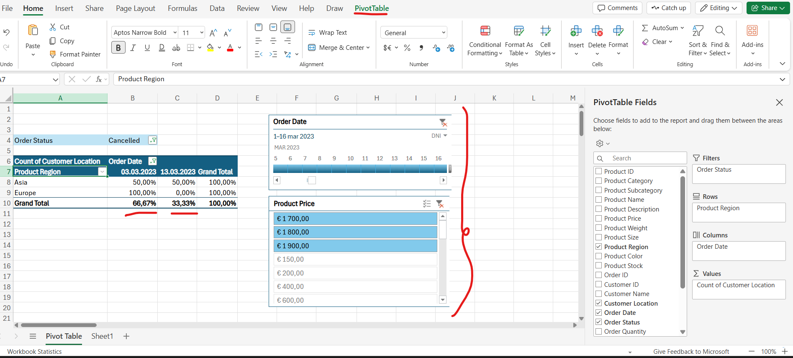

[Table of Contents](#table-of-contents)
## **5. Financial calculations**

In this section, I would like to present additional functions that we can use to interpret the results

1. Average + USD + Data Validation
- We use AVERAGE to calculate the average order amount
In the column next to it I have placed the dollar rate from today, we can set Data Validation, so that if in the future someone enters a new dollar rate, to make sure that the amount entered will not be below 0.01

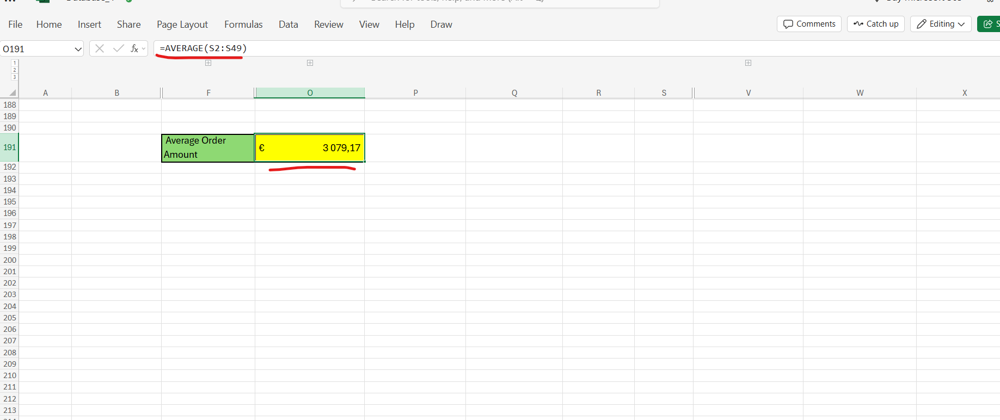

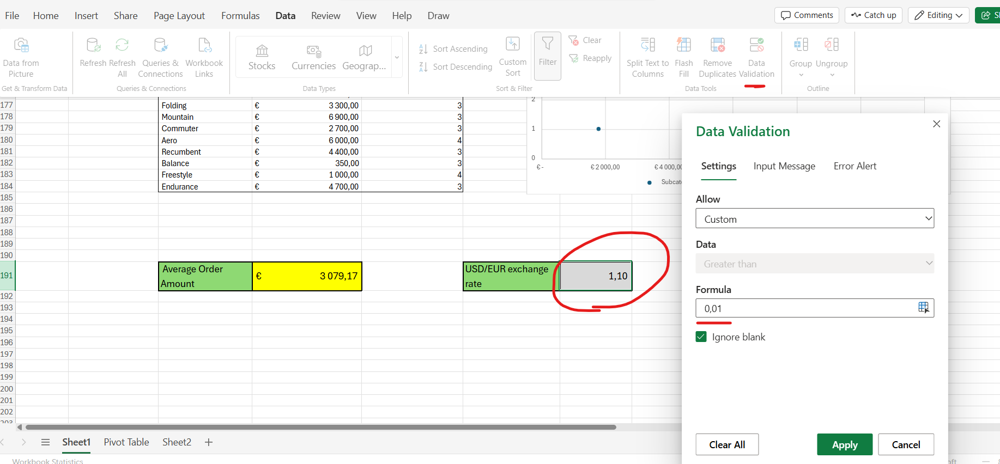

2. Gross / Net
In this example, I show how to calculate the net value of total revenue, i.e. net of tax, at a tax rate of 18%.

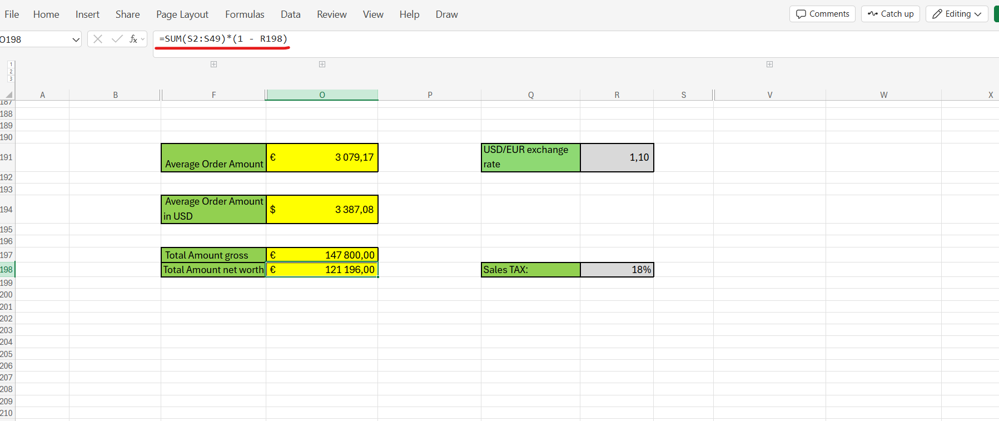

3. Profit
One of the most important pieces of information is calculating the profit, below I present the gross and net profit, assuming that the costs amounted to 80% of the revenue and the tax is 18%

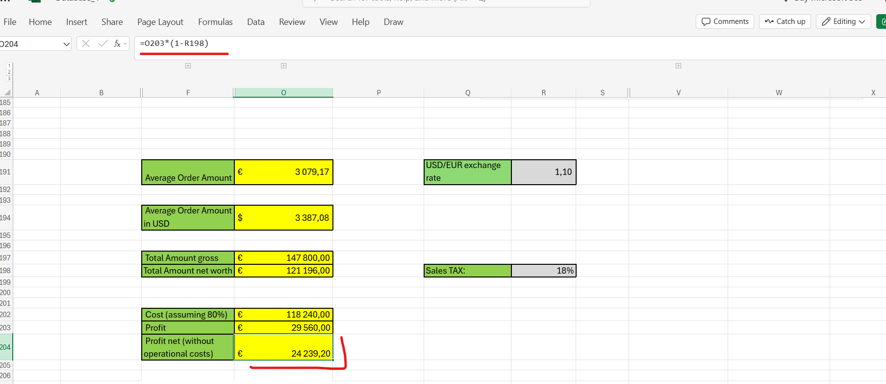

4. AOV - Average Order Value
We can calculate the average order value by dividing the sales revenue by the number of orders, as in the example below

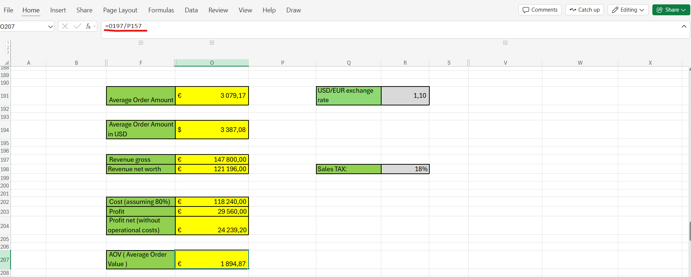

5. Unit cost
Unit cost is very useful for calculating how much money a company spends on producing one product. It is crucial when planning a budget and looking for opportunities to cut costs. The formula for this is the cost of goods sold / quantity of products sold.

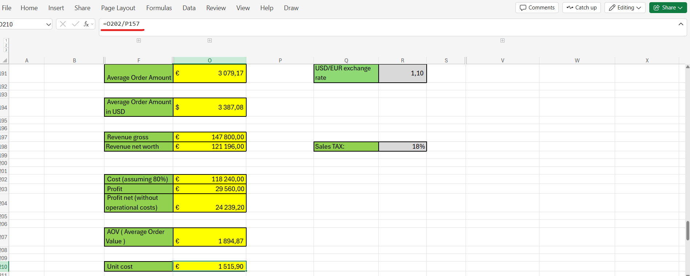

6. Profit Margin
The margin shows the company what the best prices are and helps monitor the efficiency and profitability of the given activities. The formula for margins is gross profit / revenue * 100. In this situation, it is not recommended to multiply by 100, because Excel will detect the percentage number when this form is set in a given cell.

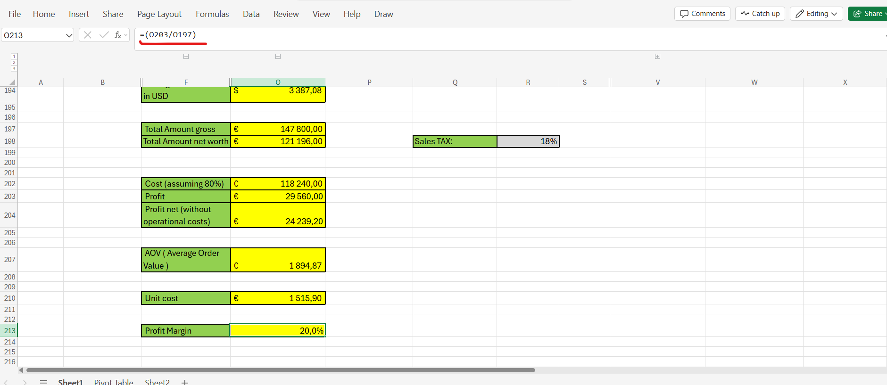

[Table of Contents](#table-of-contents)
## **6. Power Query**

In this part, I’d like to show how to upload data using a CSV file so that a table is automatically created in Excel. The data I’m using represents a sales set made up of Marvel superheroes.
We’ll use Data -> From CSV to do this

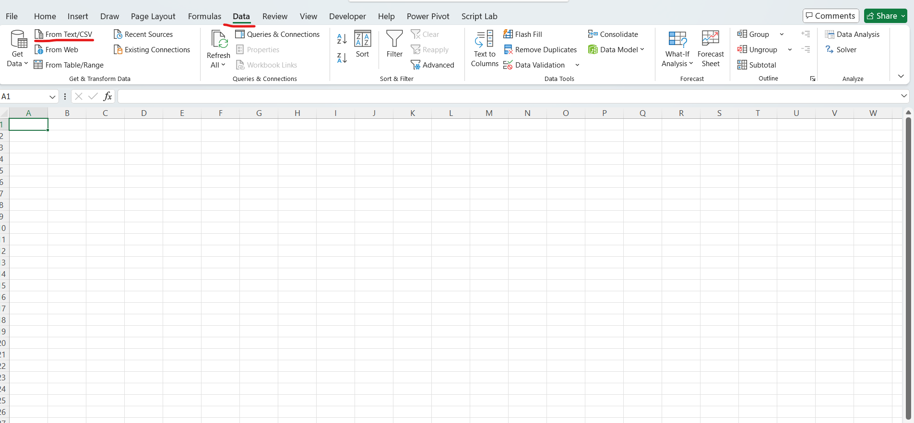

After loading the data, a window appears in which we can select the number of rows to display and the basis on which the CSV file was generated. Power Query itself perfectly detects whether the file is separated by commas, spaces, semicolons - but it sometimes happens that the data is separated by different characters or we need them to be separated in a specific way. In that case, we select "custom" from the bar

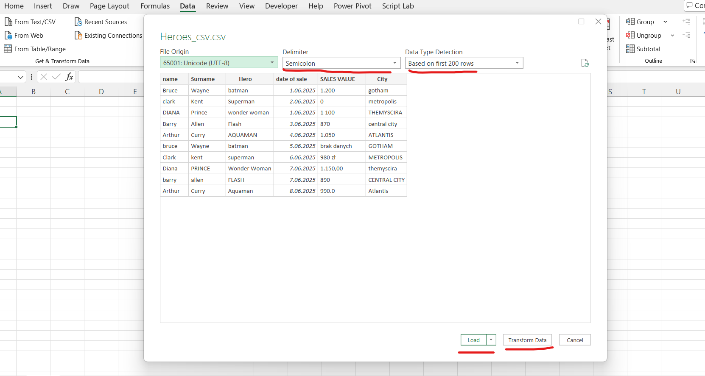

In the initial examples, I cleaned up the data from Excel using the search or "remove duplicates" functions. Power Query cleaning is also a good option, especially when using CSV files. To do this, select "transform data." If we don't need changes, select "Load". First, we should set the column titles. You'll notice they've been "pulled in." Power Query can handle this easily. To do this, select everything and choose "Use first rows as headers." Of course, we can reverse the order if necessary.

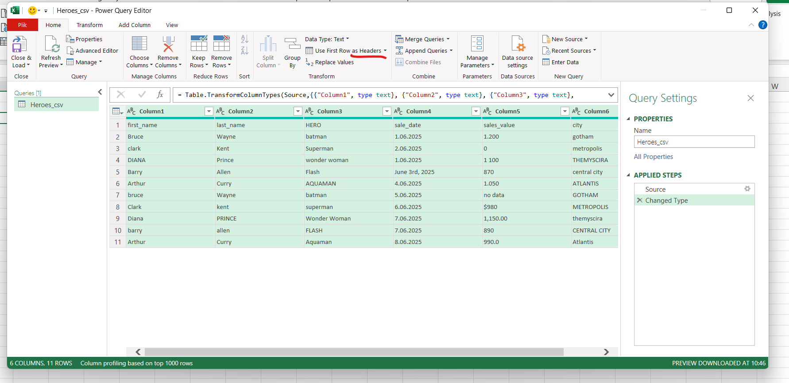

A useful feature is to mark in the "view" section what general information should be displayed at the top of the table. I recommend checking Column distribution and column quality, which will show us how many errors appear in the columns and how much data is unique.

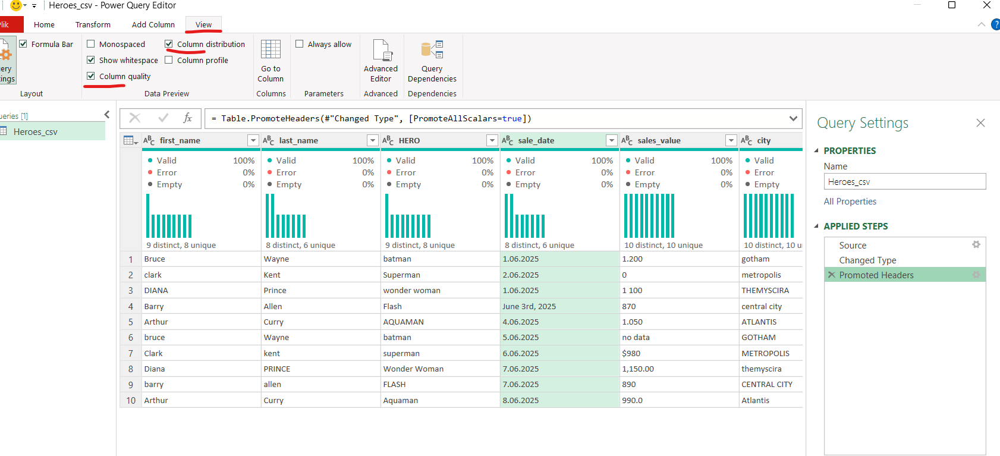

Next, we can address the duplicates in the first name and last name columns. To do this, select the two columns, right-click, and select remove duplicates. As you can see, there's also the option to remove empty, errors, or replace errors, which I'll discuss later.

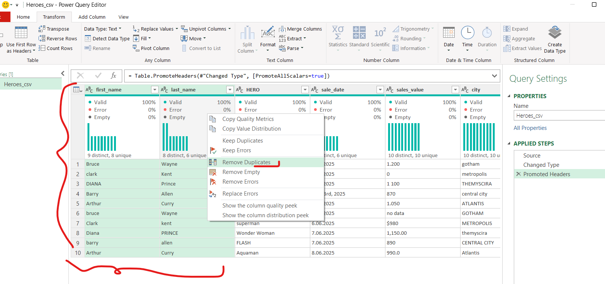

After selecting remove duplicates, only one record was deleted – Arthur Curry – even though there were more duplicates. This is because only these records were spelled exactly the same. Power Query will detect a duplicate only if it is a 1:1 match, but the characters' names and surnames are in a different order. I suggest converting them to the same form. To do this, we also select the column, but it's important to right-click on the header, go to transform, and select capitalize each word.

You can immediately see that there are many more useful functions here: trim = removes unnecessary spaces, lowercase/UPPERCASE = changes the case, clean = removes invisible non-printing characters, length = returns the length of each line, JSON / XML = changes to the data format.

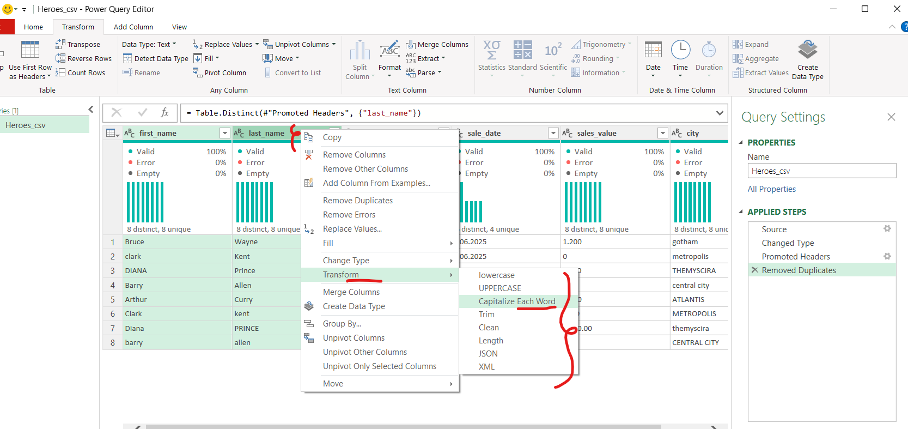

After selecting capitalize each word, the data changed to the same size, after which we can successfully remove duplicates again. Next, we can add a column that will be a combination of the superhero's name and surname. We select add column -> custom column -> combine the text using the & " " & character and select "insert".

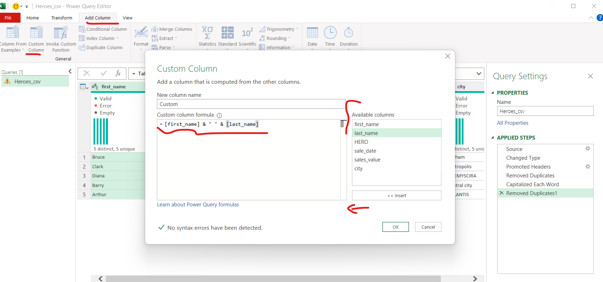

The column was added correctly, but at the end of the table and with the name "custom." I intentionally left the name unchanged in the previous step to show the option to "rename" the column. I suggest "Full name." We can also move the column to the appropriate location, starting, ending, left, or right. We can also simply drag the columns with the mouse.

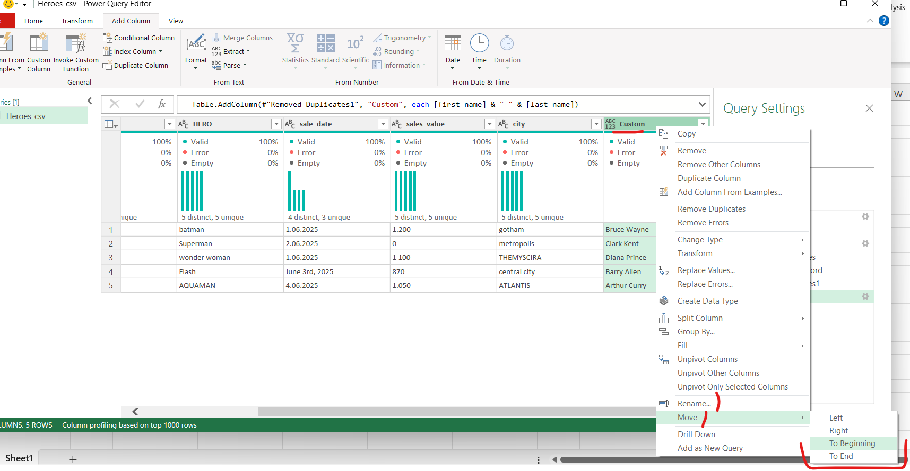

Now we can remove the first and last name columns by selecting and using remove columns. If we select "remove other columns," the unselected columns will be removed. It's also worth mentioning a very useful Power Query feature: the "change history," which appears on the right. If we want to undo a move, just click the "X" next to the last action.

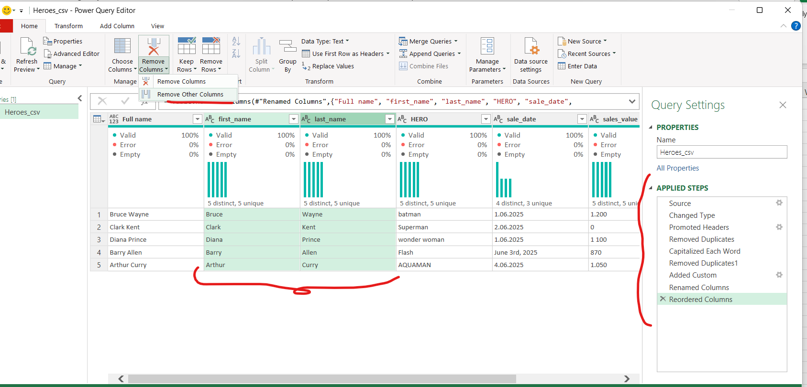

We can apply UPPERCASE operations to the "HERO" column to make the superheroes' names written in uppercase letters.

In the sale_date column, you can see that one date is incorrectly written. Additionally, the column is being read as text, as seen at the top of the page. We should replace text with date from the drop-down list, but this will cause the date to be treated as an error and result in an "error." Therefore, if we see that the date is correct but misspelled, it's better to change it manually. Otherwise, if we were to use "remove error" on the entire column, we could lose data that was good and valuable, but incorrectly written. It's crucial that the dates are written exactly the same way, so in this case, 03.06.2025. Then, in the "text" field, select "date."

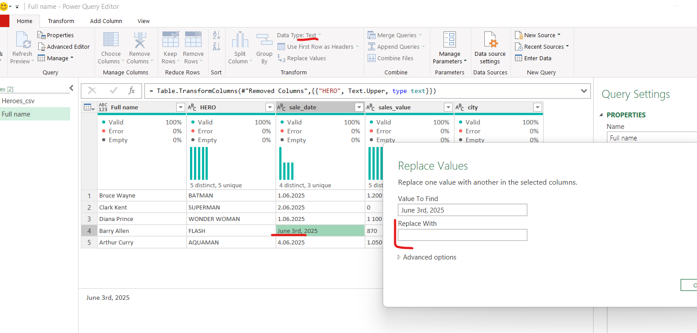

A similar situation occurs with the sales value column. After changing it to "decimal number," an error occurred, even though the data is correct. This is because the number is stored using a period, not a comma. Therefore, we also need to undo the data type change. Replace the periods with commas, and then change the data type again. We can do this by simply entering a period in the value to find field and a comma in the "replace with" field. The same should be done with the space.

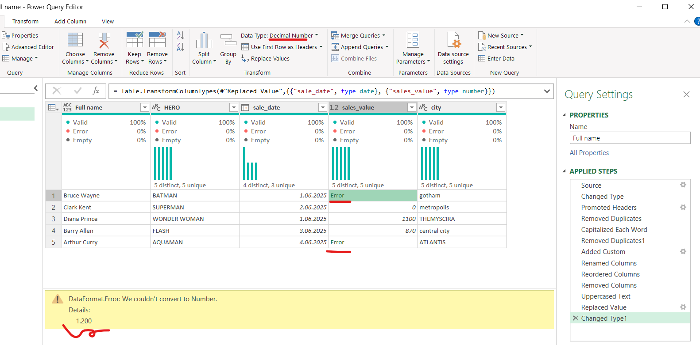

I also suggest setting column 12 to start with capital letters only. I also encourage adding a prefix before the names, which can make searching for data easier. This column contains the names of the cities where the heroes are stationed, so you can add REGION before each one. Select format -> add prefix and enter the value.

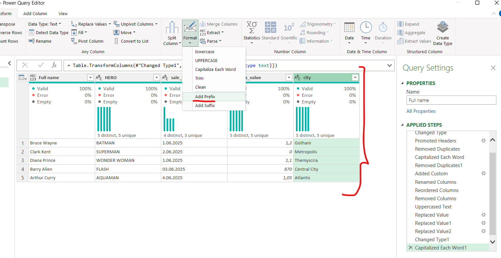

Now I'd like to show you a very useful feature, especially for hiding personal data or any type of search: part of a name, part of a URL, or a specific location in the text. In other words, "Extract." We can easily obtain the text length, first/last letter, select a specific area using range (e.g., from 2 to 5 letters), and also the text before/between/after the delimeter. In this example, I'd like to hide the characters' surnames, leaving only their first names. So, I select "Text before delimeter" and simply enter a space in the box. Finally, I'll get just their first names.

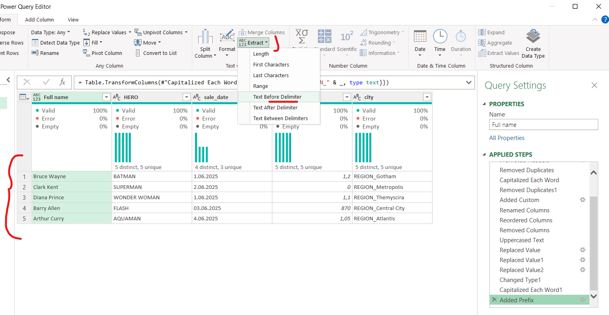

A file prepared this way in Power Query is much easier to work with. Furthermore, Power Query is much faster and more intuitive for ETL operations – Extract, Transform, Load. Once the file is ready, we can upload it to Excel using the "Close & Load" button.

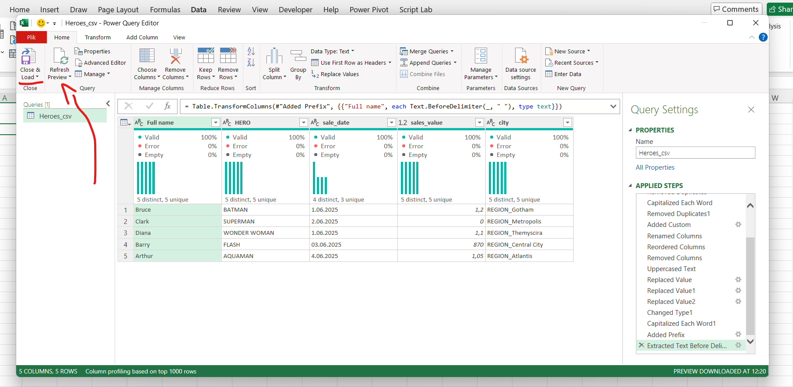

At the end, I'd like to introduce a Power Query feature called pivot/unpivot columns, which changes the layout of tabular data. This can be visualized as swapping columns and rows. This can be achieved by selecting the columns, right-clicking, and selecting "unpivot selected columns." As you can see in the attached image, "HERO" is used as a row and assigned a name. The same applies to the full name.

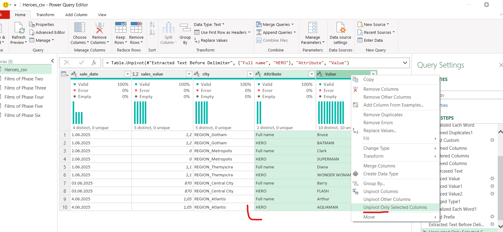

[Table of Contents](#table-of-contents)
## **7. Excel Table, Web Query, Data Validation, SmartArt, Protect sheet**

CSV data is uploaded to Excel as a table, which is often very convenient because the most frequently used functions are automatically built in. Clicking on the table will display the Table Design icon above the toolbar. It offers additional table functions and the ability to change the style. The "total row" function is very useful, creating a row below the table with totals. Furthermore, after selecting the drop-down column, you can choose whether to obtain the sum, average, maximum, etc. In cell C7, I selected the minimum value to indicate the lowest date.

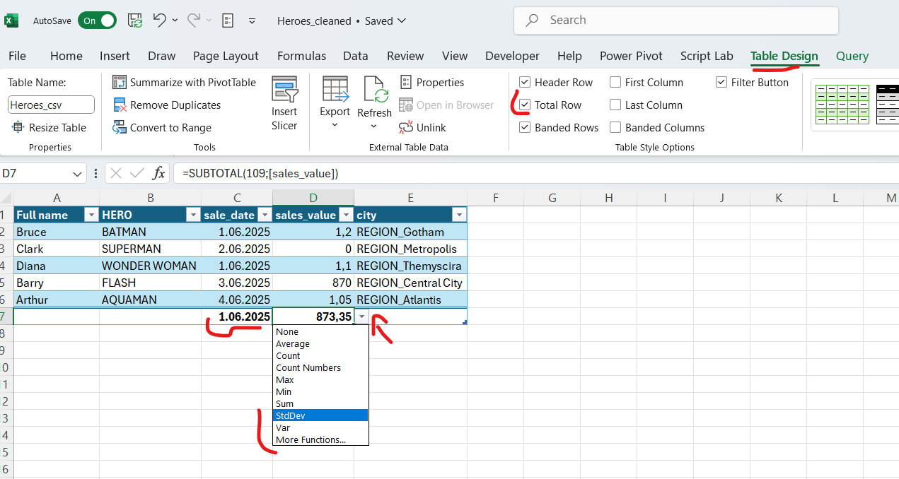

It's worth remembering that data can also be downloaded directly from a website; Excel should be able to figure out what constitutes a table on a given page and read the data. Select Data -> from WEB -> and then simply paste the address of the website from which you want to download the data.

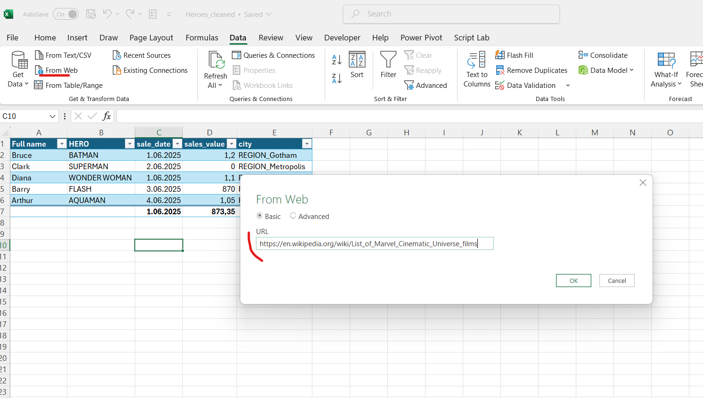

In this situation, Power Query will reopen, along with all the text that can be treated as a table. It's important to select "Select multiple items" and select all the tables you need. Then click Load.

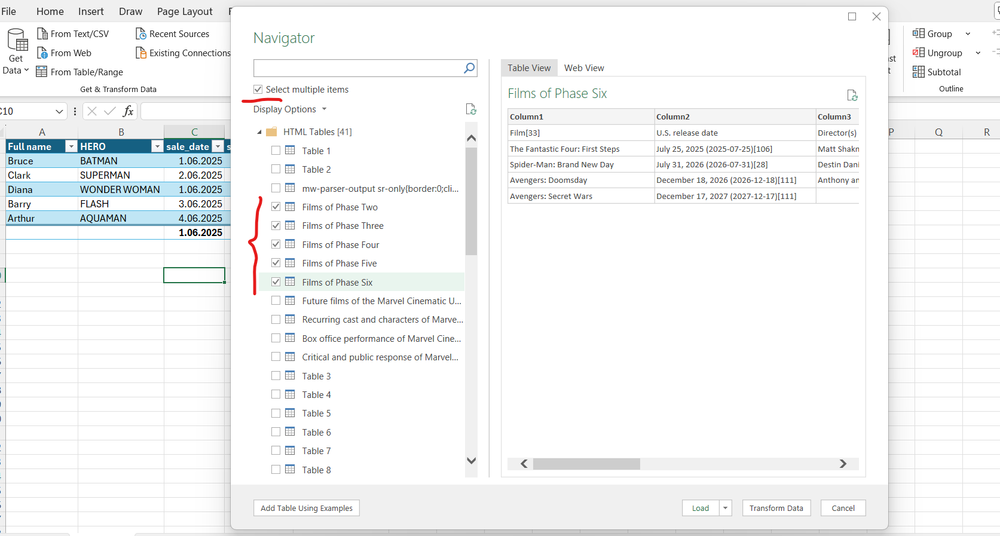

Once the data is loaded, right-click and choose where you want to place it. Select "Table" and the appropriate cell. Double-clicking on the table will open Power Query, where you can clean up the data. If you close this column, you can reopen it in Data -> Queries & Connections.

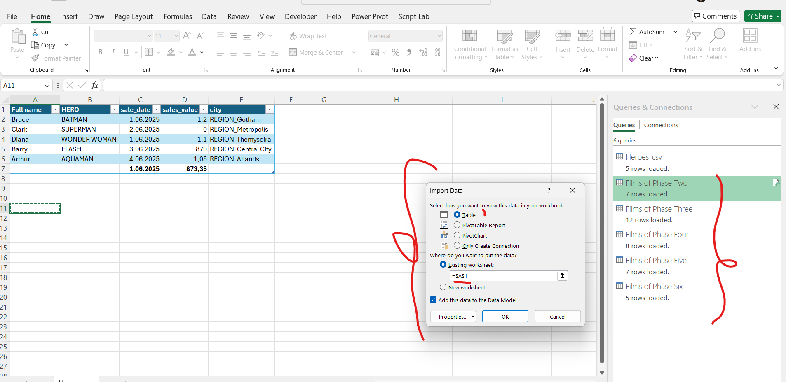

The problem with uploading these types of columns is that they are difficult to combine. The tables are separate, so even if we paste them one below the other, the filters won't capture those that fall outside their range. You would have to copy all the values and then paste them into a new cell. There are several ways to work around this problem, but with large data sets, selecting data validation and using the drop-down list is a very quick way to do this. To do this, we need to "extract the names and surnames" of the directors using the function.

    (=UNIQUE(FILTER(C12:C31; (C12:C31<>"Director(s)")*(C12:C31<>""))))

It is best to place the list somewhere nearby, it is only an aid (F34)

In the selected place (A36) go to data -> data validation -> list -> source I set to F34, where the list of directors is displayed.

In column B36 we use the usual =COUNTIF(C12:C31; A36)

Because of this, depending on which director we choose from the list, his number of films is updated.

It's also worth knowing about the password protection feature, which can be found in Format -> Protect Sheet. After selecting the elements you want to password-protect, enter the password, thus allowing others to make unwanted changes.

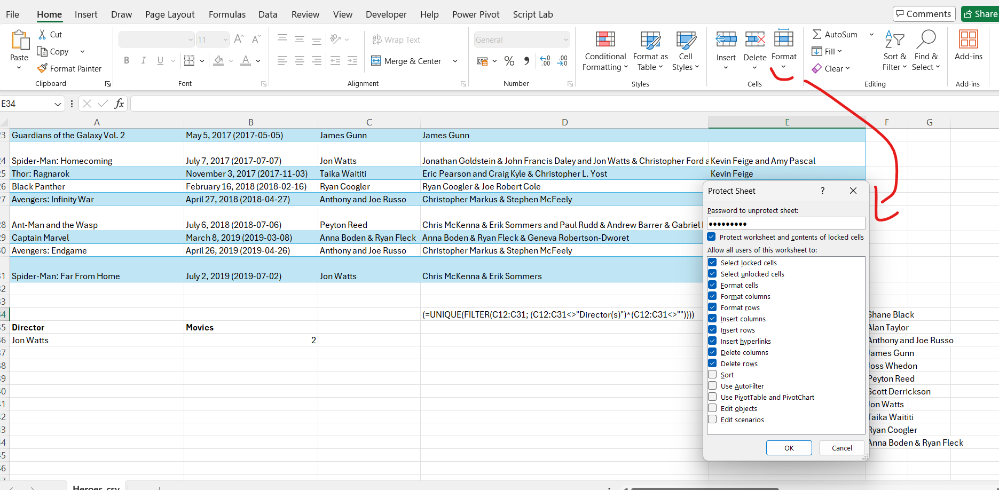

A very useful, yet underappreciated, feature of Excel is the lightning-fast creation of graphs, hierarchies, cycles, and so on. There are many programs online that can help with this, but in my opinion, Excel is the best because it automatically creates a template, which saves a lot of time because you don't have to make connections manually, and if you need more, it's very easy to edit. I also believe that writing a process this way is the easiest and most reflects a deep understanding of the subject when you can demonstrate what results from what and what influences what. This format is also very good for memory, as you have a view of the entire process, its before and after stages, allowing your mind to better encode information.

[Table of Contents](#table-of-contents)
## **8. Advanced Data Analysis in Excel**

In this chapter, I've compiled a list of superheroes, with columns for the intervention of the day, the date the superhero was involved, and the damage to public property. The last column is particularly important, as superheroes often defend entire cities, but in the process cause massive destruction. It's worth finally taking a closer look at the costs of such actions. 

I'm presenting data from June 2025. To take a closer look at the financial results, it's a good idea to start with the sum of total costs. Therefore, in row 2, I'll create a table summarizing each hero's launches throughout June.

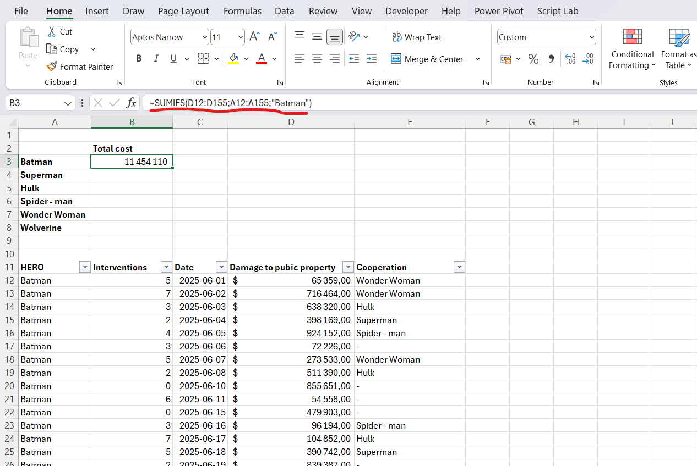

Many calculations in data analysis use "per something" coefficients: per day, per person, per mile, etc. Therefore, we will now try to check the cost of one intervention (in this case, what are the losses) per superhero. To do this, we first need to count all interventions for each character. We will use the classic sumif = SUMIF(A12:A155; "Batman"; B12:B155) and, of course, change the search word for each hero. If we wanted to drag the formula through the cells, we would need to add absolute referencing to "freeze the cells," which would be =SUMIF($A$12:$A$155; "Batman"; $B$12:$B$155).

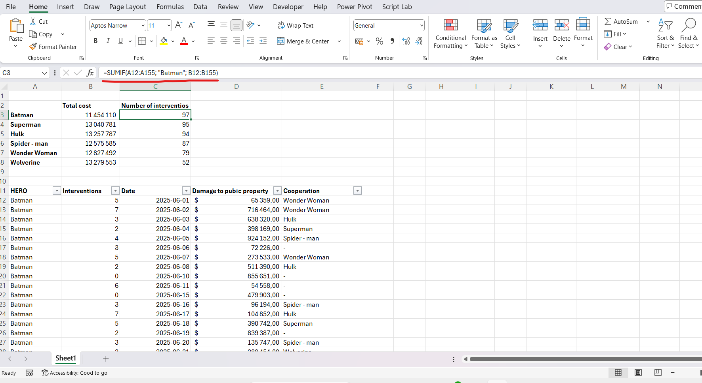

Now we can easily see that Batman had by far the most interventions. We can now easily calculate the cost per day and per intervention by simply dividing the total cost by the number of days (in this case, 30), and in the second case, by the number of interventions in columns C3:C8. Now we can add absolute referencing to "freeze cells" = $B3/$C3, thus conveniently passing the function through all heroes. In this case, there's no dollar sign before the number "3" because we want the function to loop through each cell and update to its number.

I also added cells with calculated total cost and intervention numbers, and the results are alarming. However, it's clear that Batman leads in every respect. He has almost the lowest total damage, the highest number of interventions, the lowest cost per intervention, and almost the lowest daily cost. Wolverine is ahead of him in terms of cost per day and total losses, but he has the fewest interventions and the highest cost per intervention. It's clear that Batman knows what he's doing. Superman, who has almost the same number of interventions, has a roughly 20% higher cost per day.

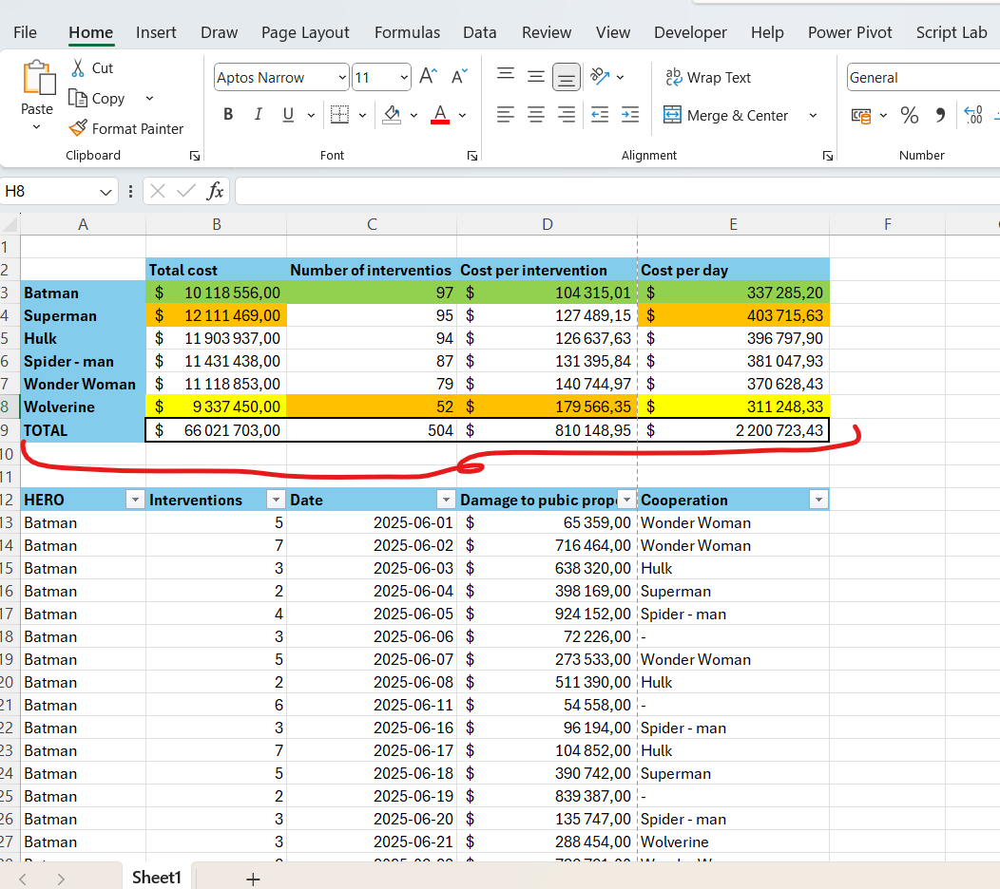

It's worth changing the colors of row headers. You can do this not only with the mouse but also with keyboard shortcuts. When you select a range, press ALT = and the letters assigned to individual Excel elements will appear. Simply select the letters to access specific functions using the keyboard shortcuts.

For example, for changing the color it will be Alt + H + H. For "wrap text" it will be Alt + H + W. For "Data Validation" it will be Alt + A + V etc.

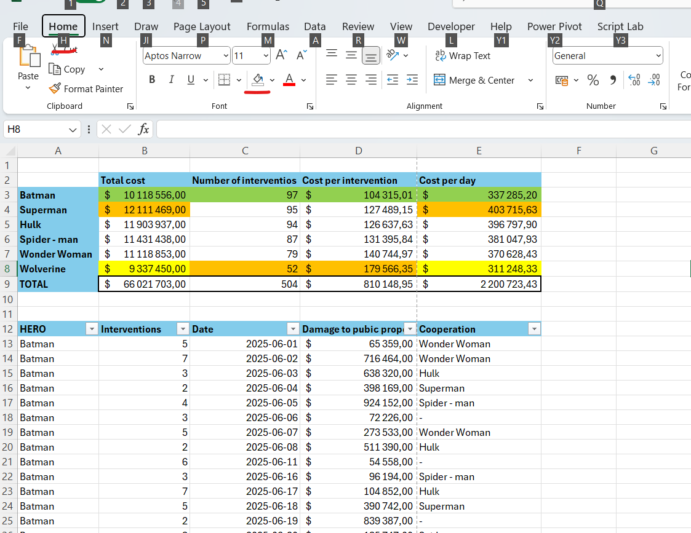

Now we can try to calculate Batman's projected damage output over the next 10 days. We'll use the FORECAST.LINEAR() function, which is a linear forecast based on historical data. Excel also offers other possible forecasts, based on seasonality, prioritizing the most recent data, and including multiple variables. Let's first try using LINEAR, which assumes the data grows linearly. The full function looks like this:

    =FORECAST.LINEAR(G2;D$13:D$36;F$13:F$36)

I'll also use ROW() to simplify the task and assign a specific number to each day. Since Batman didn't intervene every day, the total number of "working days" is 22, not 30. If we had used 30 in our forecasts, it would have been a huge error. In data analysis, you always have to check the smallest details, and this is one of them :)

It's worth adding these auxiliary columns to double the certainty and simplify your calculations. We enter -15 because we're starting the calculation from row 16, meaning we're subtracting 15 inclusive.

Next, in column G3, we enter the number of days ahead we want to forecast. In this case, we enter 10 days counted from 22, i.e., from 23 to 32 inclusive. The FORECAST.LINEAR() function is in cell H2, and it displays the value of Batman's losses for each subsequent day in cells H. As you can see, these values increase gradually, because this is an exponential forecast, which assumes continuous growth. In this case, this is an incorrect assumption, because, as we can see in the table, Batman experienced very different damage amounts, sometimes in the tens of thousands, sometimes in the hundreds of thousands. To further illustrate how the linear forecast works, I've included a graph of the function it assumes.

Y = 7478,3x + 3E+08

This can be easily verified by subtracting the next two days. I performed this operation in cells H16 and H17. You can see that the difference between the days is 12,683, which is the amount the function increases by each day. The graph only confirms that the damage amounts are randomly distributed and do not cluster along a straight line. Sometimes such confirmations seem obvious, but when dealing with large numbers and the responsibility that analytical results carry, it's crucial to confirm everything using multiple methods.

To add trendlines to a chart, select Chart Design -> Trendline -> Linear Trendline. To display the function, select More Trendline Formats -> Format Trendline and select "Display Equation on Chart."

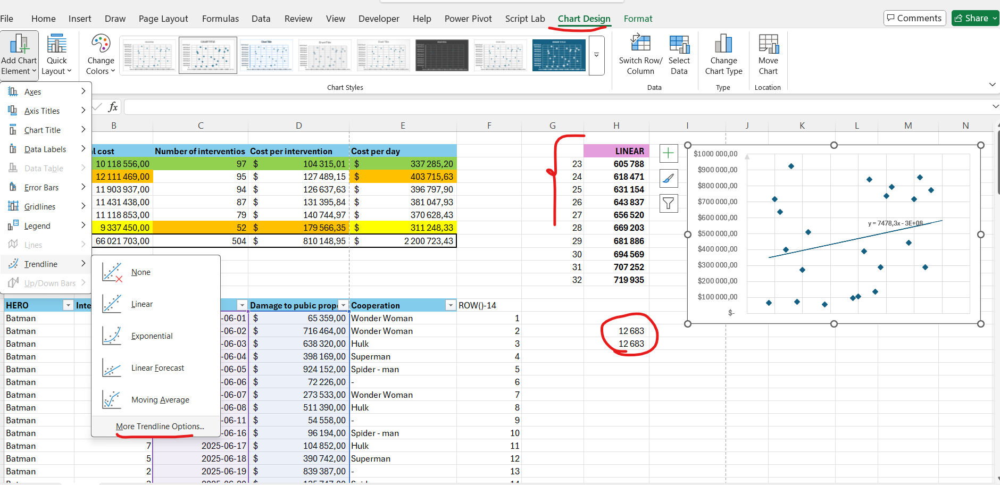

To further confirm that FORECAST.LINEAR isn't the best method in this case, because expenses don't grow linearly, we can use a sum function, which will count expenses broken down by the appropriate intervals. In this case, I've assumed the function would count three rows and then move on to the next three. We can achieve this by combining the SUM + OFFSET + ROW functions.

    =SUM(OFFSET($D$15; (ROW()-ROW($H$15))*3; 0; 3; 1))

OFFSET, or shift, describes which cell to start shifting from, how many columns and rows to shift, and what the height and width of the final result should be. The idea is to calculate the ROW result - ROW (from the starting point) multiplied by 3. For example, 16 - 15 = 1. 1 x 3 = 3. 17 - 15 = 2. 2 x 3 = 6. Therefore, the final shift from H15 is the result of this operation, i.e., 3, 6, 9, etc. rows.

Now we can check the forecast. Day numbers alone aren't enough; we need to print specific dates (I3:I12), then we can use the function =FORECAST.ETS(I3; D15:D36; C15:C36). As we can see, the results are much closer to the truth because this forecast tries to capture seasonality, i.e., it looks for recurring patterns and smooths the results. To confirm all the calculations, I added a line chart showing how Batman's costs vary over time.

To get an even more complete picture, especially with such random data, it's always worth calculating the mean and median, which can indicate whether the predictions are below or above the most average results. I've placed them in cell K.

It's also worth calculating kurtosis, a statistical measure that describes the "spiciness" of a data distribution. In this case, the result is -2, meaning most of the data is far from the mean and has fewer extreme values. I also added MODE, which returns "no mode" if the values were only unique, so calculating the mode would be impossible. This is also a great opportunity to practice using IFERROR, a function that runs when an error is returned. In this case, mode would be #N/A if there were no repeating values.

    =IFERROR(TEXTJOIN(", "; TRUE; MODE.MULT(D16:D37)); "No mode")

Finally, it's worth calculating the standard deviation to assess how widely the data is dispersed around the mean. In Excel, we can use the STDEV.P (entire population) or STDEV.S (sample) functions. Since we're analyzing data from an entire month, we assume we're dealing with a population—so we use STDEV.P. The result is 294,245, meaning that the average deviation of values from the mean (459,934) is this much. Intuitively, we can assume that most values (about 68%) fall within the range: 459,934 +/- 294,245 → i.e., from 165,689 to 754,179. Of course, there can also be values much further from the mean—especially if the data are not normally distributed.

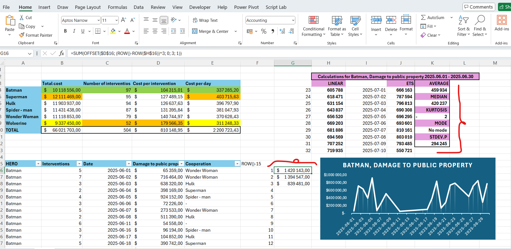

Another very useful measure in statistics is SKEW, or skewness. As with standard deviation, we have options for sample skew and total skew. Since our data covers a full month, we can confidently choose SKEW.P. In this case, the SKEW value is 0.026971, very close to zero. This means there is no significant skew to the right or left; the distribution is nearly symmetrical.

Next, it's worth calculating the RANGE. That is, subtract the MIN value from the MAX value. The large range (869,594) between these values compared to the median and mean suggests that several values are far from the rest, which raise the maximum value.

We've already calculated the standard deviation; we know the data is highly dispersed. However, to provide another way to verify this, I also calculated the variance. This is based on the same data as the deviation, only it's squared, and the deviation has its square root taken. Regardless of how you look at it, you can see that the data is highly dispersed; the variance is a whopping 86580219016.4132. When we take the square root of this number, it's the same as the standard deviation.

Now I've calculated percentiles, a measure that shows what percentage of all results fall within a given percentage. The result will be calculated based on the number we choose. In my case, =PERCENTILE.EXC(D16:D37, 0.9), I set the number 0.9 at the end, which equals 90%. Therefore, the result, 850,200.60, means that 90% of Batman's cost records are less than or equal to 850,200.60. If we had set 0.5 instead of 0.9, we would have obtained a value in the middle = the median.

The last metric I'd like to present is correlation. This is a very useful metric that shows the relationship between two variables—how one variable influences the other. Using a date might not be the best idea here, but correlating damage with the number of interventions will certainly work.

The correlation is 0.19, meaning the relationship between the cost of losses and the number of interventions is quite small. In this case, we can't assume that the more interventions Batman has, the higher the cost of damage. We could already assume this from the first table, using the example of Wolverine, who had almost 50% fewer interventions compared to Batman, yet his damage costs were very similar to Batman's. However, in data analysis, as in business, it's always worth confirming any assumptions with numbers :)

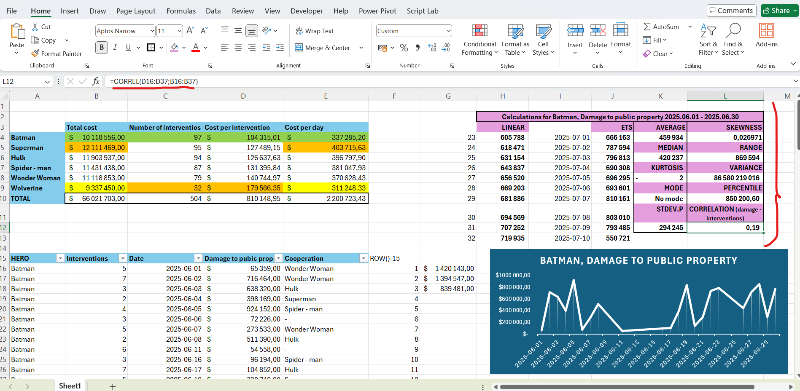

To further enrich the analysis, we can calculate a normal distribution, which will either indicate how close a given result (in this case, Batman's losses) was to the typical price (close to the average), or the PDF. The higher the PDF value, the more "typical" the result; the closer to zero, the more outlier it is. Next, I calculated the CDF, or cumulative distribution function. They work similarly to percentiles, calculating the probability that a random variable (normally distributed with mean and deviation) will assume a value less than or equal to a given sales value.This means that where 9% is present, approximately 9% of the values in the distribution are less than or equal to that particular sales value. Where 94% is present, this means that 94% of the values are less than or equal to that sales value.

These calculations allow us to further understand whether the results are typical or should be of interest. Perhaps there's a hidden relationship? You can see that when Batman and Wonder Woman collaborate, three out of five times the losses were very high, and two times lower than the average. If we look at the number of interventions, we see that high losses occurred when Batman and Wonder Woman had a minimum of 6 interventions, and when losses were low, they had a maximum of 5.

This way, we could create a hypothesis that if someone works with Wonder Woman and has more than 6 interventions, the losses could be very high. Now, to verify this, we would need to analyze this using examples of other heroes. This is a perfect example of how the normal distribution and in-depth analysis can reveal hidden patterns or relationships that might otherwise be invisible to the naked eye. This is especially true when the correlation we calculated in the previous chapter showed that there is no direct relationship between the number of interventions and expenses. However, as it turns out, when other heroes are added to the mix, the result can change.

CFD allows for pinpointing the largest losses. Of course, there are many ways to do this, but this is most useful when we don't know a single result and the data is constantly arriving in streams. In that case, the function can add everything up and determine the percentage on the fly. Of course, you can also manually calculate the MAX value and determine the result that would meet the minimum threshold. 90% MAX. However, this would require us to check it periodically and would be more prone to errors.

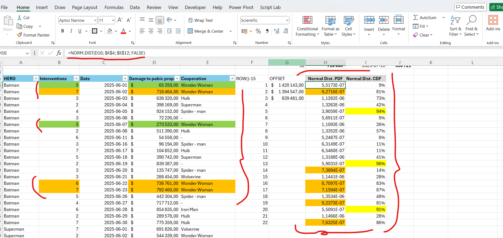

In the table I created in cells A3:E10, we've more or less concluded how Batman outperforms everyone else, and how Wolverine is performing poorly. However, as I mentioned, it's worth checking everything with numbers when analyzing data. To ensure these results aren't random, I'll use T.TEST, a statistical sampling test that checks to which the values could have been random. This will allow us to determine whether Batman is actually that good and Wolverine needs some training, or whether it's just a matter of extreme luck.

The test commands are very simple: =T.TEST(B16:B37;B125:B142; 2; 3).

The result for interventions is less than 1% – here we can be sure that Batman is a harder-working superhero. Such a low result means that Batman's high number of interventions and Wolverine's low number are not a coincidence, but are statistically significant. However, the result for the amount of damage is a whopping 52%, which is a significant number. It can be clearly stated that the difference between the groups is purely coincidental. Since Wolverine's total damage output lags behind that of other heroes, given his low number of interventions, it can be assumed that he caused such extensive damage to the city due to random events, not a lack of skill. Conversely, Batman was quite fortunate that, despite his high number of interventions, the damage he caused was relatively minor. However, to answer these hypotheses, a longer period of time would be necessary.

In Excel, in the upper right corner, in the Data tab, you'll find Data Analysis – this tool allows you to perform numerous analyses and tests. I used the Single Factor ANOVA test. This is a statistical method for comparing the means of more than two independent groups. It's an extension of the Student t-test, which can only be used to compare two groups. Therefore, we'll add the SUPERMAN results to gain a broader picture and also ensure that the "Damage" results could have been due to chance, as indicated by the T-test. For everything to work correctly, the data must be the same length. As we remember, the heroes had different intervention days. Therefore, I'm pasting all the data and truncating them to the same number in cell G41:I59. This reduces the rows to 18.

I choose Data -> Data analysis -> Single Factor ANOVA -> I select the G41:I59 area and set the grouping to columns. I select the header reading options and where I want the results to appear. The first table, SUMMARY, contains the summaries. We can see that the data differs from those we already calculated for Batman, because there are 18 rows here.

The most important task of ANOVA is to determine whether the differences between means are significant (P-value), how strong these differences are (F ), and whether the null hypothesis can be rejected (F > F crit). The null hypothesis in statistics always means the absence of any differences, relationships, etc. In this case, it is the assumption of Stagnation and the status quo :)

SS = variability. The important factor is the larger variability. Within -> means within each group. Between is the variability resulting from the differences between groups (i.e., how much the sales averages differ for Batman, Wolverine, and Superman). In this situation, there is greater variability within each character (i.e. between Batman and Batman), not between them.

DF = This is the number of independent values that are free to vary, i.e., the splits that occurred.

MS = Mean Squares (average sum of squares)

F = This is the main ANOVA metric. It shows whether the variability between groups is greater than the variability within groups. The larger the F, the greater the chance that the means are truly different.

P - value = This is the most important test result. It tells us the probability that such differences between means arose by chance. P = 0.319, or a 31.9% chance that these differences are purely random. This is slightly less than the T-test indicated, but still quite high.

F crit = This is literally the threshold value that must be exceeded to conclude that the differences are statistically significant and not due to chance. Because F = 1.17 < F crit = 3.179, there is insufficient evidence that the sales means of Batman, Wolverine, and Superman are significantly different. There are differences, but they are not large enough to be certain that they did not arise by chance.

Now, two methods confirm that the destruction results are rather random and no hero can be directly blamed, especially based on only one month.

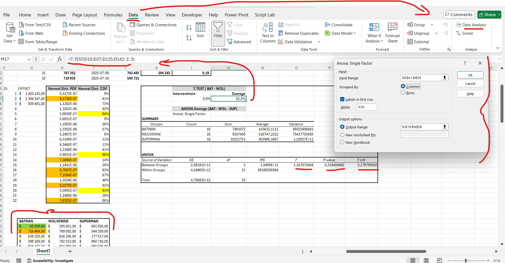

The next tool I'd like to present is the Forecast Sheet, an automatically generated forecast by Excel. To create one, select the dates and the number you want to forecast. In this case, this will obviously be the Damage value. I select the area -> Select Data -> Forecast Sheet. Then, we determine how far out we want the forecast to be. Confidence Interval = This is the forecast's certainty (confidence interval) and determines how much we can trust the forecasted values. By default, Excel sets 95%, meaning that with 95% certainty, the forecasted value will fall within the calculated range (the so-called uncertainty band). If we set the value to 30%, the orange lines would simply be closer to the centre.

Seasonality, When we have a lot of data—as in this case, over 20 days—it's best to leave the seasonality to be automatically adjusted. However, if we have fewer dates, or we're certain of a cycle, for example, every 7 days or every 6 months, simply select that number as the seasonality. Missing points and duplicates are best left as they are automatically adjusted. Once you're done, click create. This is a very useful tool that can quickly provide at least a point of reference for forecasting results, thus facilitating further steps.

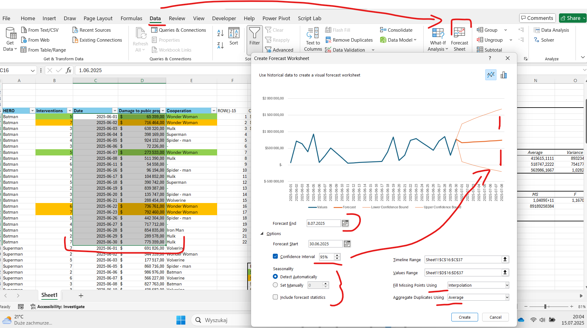

[Table of Contents](#table-of-contents)
## **9. LAMBDA, What-if analysis**

Another powerful analytical tool is what-if analysis, which offers three options; I'll walk through each below.

Creating scenarios allows you to choose which cell to change and to what value. This allows you to easily switch between different options, and the remaining data updates automatically. As in this case, changing the number of interventions for Wonder Woman automatically changes the cost per intervention. However, I personally find it more practical to create a table that immediately displays the different scenarios. The scenarios pane also offers merge and summary options. Merge allows you to load scenarios from another spreadsheet or Excel file into the currently open spreadsheet, provided both use the same input cells. The Summary function, on the other hand, creates an automatic report comparing all scenarios.

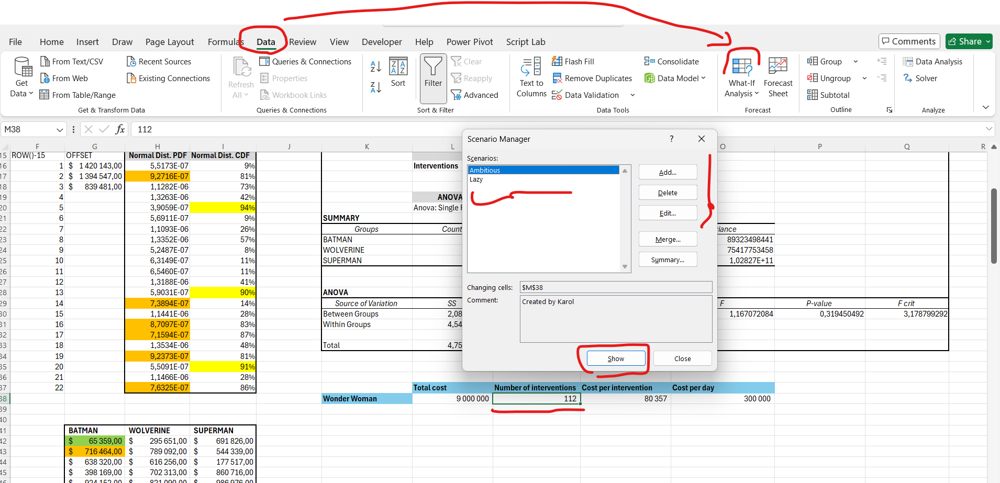

The second function is Goal Seek, which searches for the answer to the question of how much we need to change a given value to achieve the desired result. In this case, I want to check how much the total cost must change to reduce Wonder Woman's cost per day to 300,000. We select the cell we want to change, the value to which, and which cell to change. This is very useful because we quickly get an answer to something that would otherwise take a long time to find. In this case, I know that for the cost per day to be 300,000, the total cost must be 9,000,000. This is especially useful for more complex calculations.

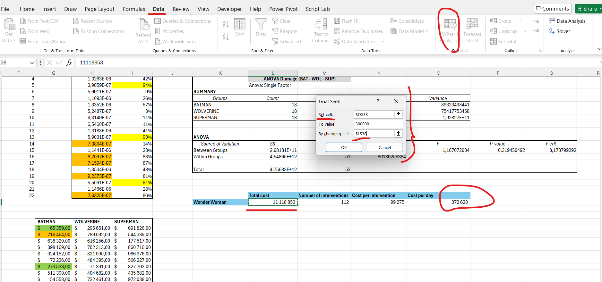

The third function, data table, is often referred to as array functions. It's very useful, allowing you to quickly see how changing one or two variables affects the result of a formula. It's useful, for example, when modelling scenarios involving costs, profits, loan instalments, and so on. It works a bit like a simulation matrix – you specify input values (e.g., various prices and quantities), and Excel automatically calculates the result based on them. In this case, I'm checking how the cost per intervention changes as the total cost and number of interventions change.

The first column says that if the total cost is to be 5 million and there are 120 interventions, the cost per intervention will be 41,667, etc.

For table functions to work correctly, there must always be a reference point for the operation being copied. Therefore, in this case, cell K42 references cell N38, which contains the Total Cost / Number of Interventions division function. It's important to enter the specific values for which we're looking for scenarios, both in rows and columns. Then, we select the entire area, including the headers, then choose what - if analysis -> Data table -> and, in the corresponding column, select the cell that corresponds to the column (in this new table), but using values from the first table. In our case, this is L38 = Total Cost and the cell that corresponds to the rows (also in this new table) with values from the first table = M38.

This can be a bit confusing, as you're selecting data from the old table for the new table, but after a few tries, everything becomes clear. It's important to remember that the cell that indicates the action, i.e., K42, or a link to it, should be in the upper left corner, above the rows whose results you want to predict. Ultimately, we obtain a set of combinations for each option regarding the number of interventions and the total cost. This allows us to quickly see that if the total cost is 7 million and there are 120 Wonder Woman interventions, the cost per intervention = 58,333, and if there are 150 interventions, the cost = 46,667.

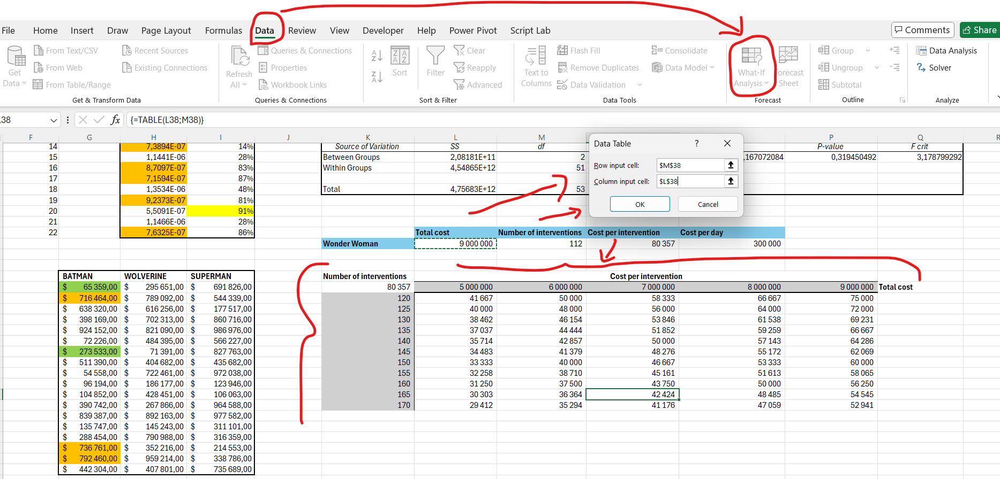

The next very powerful function I'd like to present is LAMBDA. Briefly speaking, it's used to store a function and its arguments on a single line. It works very similarly to Lambda in typical programming languages. The first character is always the value to be entered in the LAMBDA, followed by the second value or the operation itself. For example, this is what the squaring formula looks like. After the function is (5), meaning that 5 will be inserted instead of "x."

    =LAMBDA(x, x * x)(5)

In line B12 I entered the lambda function which immediately performs the division.

    =LAMBDA(cost;number;cost/number)(L38;M38)

In this case, it divides the total cost by the number of interventions, i.e., in a single cell. We can, of course, apply this to multiple records; in this case, we need to use MAP because LAMBDA doesn't "know" to operate on every element of the array. I'm using this function in the F4:F9 range, and you can see that the results are the same as in the table below.

    =MAP(B4:B9; C4:C9; LAMBDA(cost;interventions; cost / interventions))

So, LAMBDA described the action -> get "cost", get "interventions". Then, divide the cost into interventions. And MAP determined what constitutes cost and what constitutes interVentions. This allowed us to calculate the results for all heroes in a single line. Of course, we can add text in the same way. Below, I'll show you how to add "Hulk" to Batman and Superman.

    =MAP({"Batman";"Superman"}; LAMBDA(x; x & " and Hulk"))

Another useful function is REDUCE. Its biggest advantage is that the "a" argument is constant and can be used to represent any cell. The "b" argument, however, is a list. This allows us to quickly count how many times Batman has been a companion to the heroes.

    =REDUCE(0; E15:E142; LAMBDA(a;b; a + (b = "Batman")))

The initial value is given as 0, then the array, i.e., the range E15:E142, and two arguments in LAMBDA: a and b. A is already assigned 0, and B is assigned the above range, but we add the condition that b is to be counted only if it is = "Batman." There are many applications of such operations, and although each could be done with simple calculations, including them in one place significantly speeds up the recording. Below is an example that only sums the total values of interventions whose number was > 90.

    =REDUCE(1; C4:C9; LAMBDA(a;b; a + IF(b > 90; b; 1)))

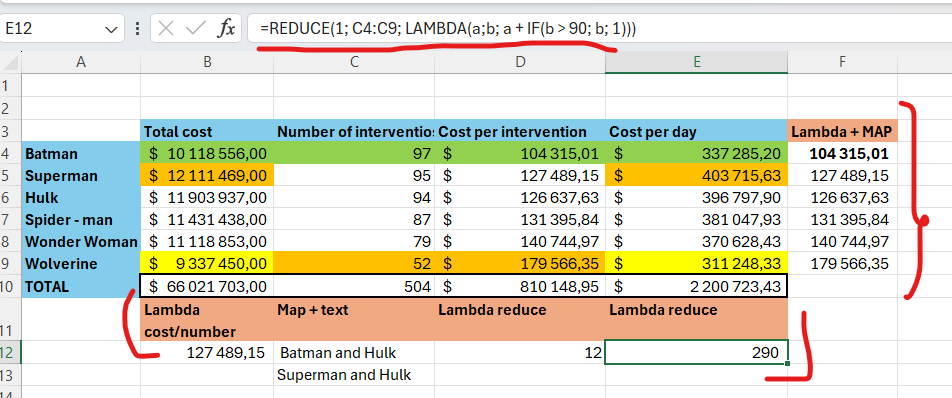

LAMBDA SCAN works very similarly, returning consecutive results. In this case, I subtract the numbers contained in the array from the hypothetical number of Wonder Woman's interventions. This gives us the results.

    =SCAN(K43; {10;20;30;40}; LAMBDA(a;b; a - b))

Another very good function is BYROW. It's often used with LAMBDA because we can easily iterate over given rows and perform an operation on them. Let's say we want to increase the number of hypothetical losses suffered by Wonder Woman by 5000. We can do this very quickly using BYROW, which skips through the rows in a given range.

    =BYROW(K43:K53; LAMBDA(a; a + 5))

BYCOLUMN works similarly, iterating over columns, allowing us to easily perform calculations or change values in the specified columns. In this example, we want to quickly see how Wonder Woman's damage value would change if she participated in an intervention with another hero, and theoretically, the costs could double.

    =BYCOL(L42:P42;LAMBDA(a;a*2))

Another function often combined with LAMBDA is MAKEARRAY, which creates an array. It's also worth noting that LAMBDA's greatest advantage is storing calculation data in memory for easy reuse. It's a mini version of macros and VBA, which can make life significantly easier. Unfortunately, LAMBDA in Excel can't handle very large numbers; in such cases, it will return the error message shown below.

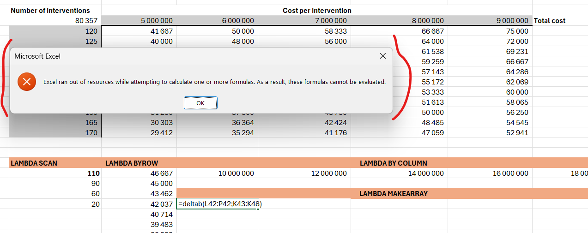

However, it works very well for simple tasks that take much longer than they should, and are very easy to automate. In this example, we'll try to assign the next superheroes to accompany Wonder Woman in advance. To add your own function, go to Formulas -> Name Manager -> select New. You'll be given the option to create a new function. Enter the name you want the function to be called, in my case, "hero." Replace "refers to =" with its code. It's best to write it elsewhere and copy it. LET assigns variables to rows and columns, defining the "dimensions" of our array. MAKEARRAY = creates an array with predefined dimensions. Each cell is calculated using the LAMBDA(r; c; ...) function, where r is the row index and c is the column index.

A rather complex formula in MOD, it's easier to break it down into pieces. The goal is to convert the coordinates of cell (r, c) to a sequential number from 1 to 5, which will indicate the name of a character from the list. This converts the position (r, c) to the cell number, counting from 0 rows left to right. Position (1,1) → (1 - 1) * 7 + 1 - 1 = 0. Position (1,2) → 1, etc.

    =LET(
      rows; 3;
      cols; 7;
      MAKEARRAY(rows; cols; LAMBDA(r; c;
        CHOOSE(
          MOD((r - 1) * cols + c - 1; 5) + 1;
          "Batman";
          "Superman";
          "Hulk";
          "Spider-man";
          "Wolverine"
        )
      ))
    )  

As mentioned in previous chapters, MOD returns the remainder of dividing a number by the divisor. MOD(...; 5) causes values to cycle through from 0 to 4, regardless of the cell number. The +1 function is used to return values from 1 to 5, which is the number of heroes in CHOOSE =. This function selects heroes in this order: 1 = Batman, 2 = Superman, etc. The biggest advantage of this solution is that you can then simply enter =function_name(hero) and Excel will do the rest for you.

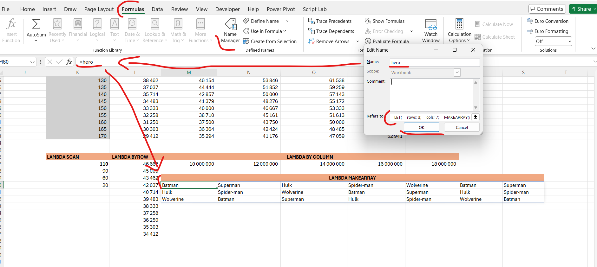

We can also use the LET function to enter a range we consider appropriate, for example, to select only Batman and Superman from the cells we specify (A4:A5). This allows us to easily control which range we want to use at a given time. For this purpose, we use the LET function, which automatically adjusts RANDBETWEEN to the specified range. First, LET determines the range using ROWS(range). So, if the range is A4:A5 in my case, then number = 2. Then, we use MAKEARRAY with constant values, which we know from the previous example. RANDBETWEEN randomly selects a number from 1 to number -> the number previously specified in range. In my case, it's 2 (Batman and Superman). Finally, INDEX retrieves the number from range that was randomly selected in RANDBETWEEN. I named the function heroran = hero + random.

    =LAMBDA(range;
    LET(
      number; ROWS(range);
      MAKEARRAY(3; 7; LAMBDA(r; c;
        INDEX(range; RANDBETWEEN(1; number))
        ))
      )
    )

The biggest drawback of this solution is that after each operation in Excel -> RANDBETWEEN will be automatically reused and return new values. There are ways around this, for example, adding a cell that must contain a specific value to perform the randomization. However, this would be a very complex function, and in this situation, using a macro—code written in VBA—is much more useful. I'll present the details of this in the next and final chapter.

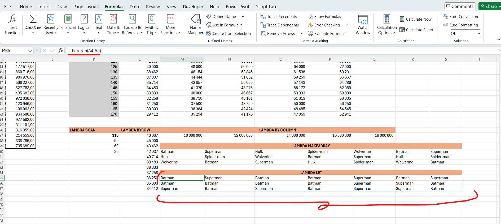

[Table of Contents](#table-of-contents)
## **10. VBA**

Let me start with a brief explanation of what macros are in Excel: they're nothing more than automatic, recorded, or written functions that are executed one after another. These can be anything available in Excel. For example, bolding text in specific cells + adjusting the width + conditional formatting + adding a column with a total. Once we record a macro this way, we can later execute these actions with a single click.As a rule, it's faster to record simpler macros — by enabling macro recording and performing the actions we want to record. More complex macros, however, are better created using code. Each recorded macro is automatically converted by Excel to VBA code.

I created a file with sample data from a music store's weekly sales. Column A contains the days of sales, column B the number of orders, and column C the amounts. As you can see, much of this data is misspelled: one date is a number, some order numbers contain spaces, and the same is true for order amounts. The headers also need to be improved. These are not complicated changes, but we can use macros to "fix" everything with one click.

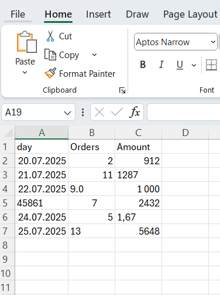

The most important thing when recording macros is to prepare the spreadsheet so that you don't make any unnecessary movements. The recording will record every click and every change, so it's important to have everything ready. Therefore, I recommend selecting cell A1. Once you're ready, select the Developer -> Record Macro tab. A macro recording window will appear. You can choose any name and shortcut. I recommend not overwriting commonly used shortcuts like Ctrl + C or Ctrl + A, but rather using Shift. In this case, I use Ctrl + Shift + E. You can also skip any shortcut and select the macro in the future by clicking "Macros." The last thing we need to choose is where the macro will be saved: in this sheet, "in all Excel," or in a new sheet. I think it's best to save macros that are universal, so I choose "all Excel."

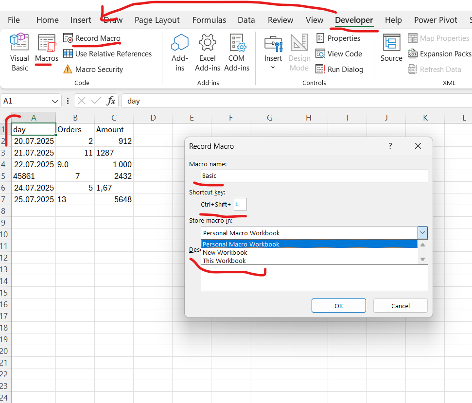

We can correct and bold the headings. We can change column A to make all values date-based, change column B to general numbers, and column C to decimal numbers with two decimal places. We'll also add four rows above, which are typically used for sheet titles, data analysis periods, etc. All the macros I'll create now (I'll show them in a GIF at the end) run one after the other. After completing the steps, I noticed that some of the data was incorrectly recorded. In cell B4, a dot is used instead of a comma, so the number didn't change, and in C6, the comma was placed in the wrong place—I can only guess, since the number of orders is 5 and sales is $1.67. It's probably impossible. This is a good example because it demonstrates the importance of double-checking in data analysis and how sometimes full automation can be detrimental, as we might miss an error. I can't apply the comma change to all the numbers, as it could distort the others—so I have to correct the data manually here.

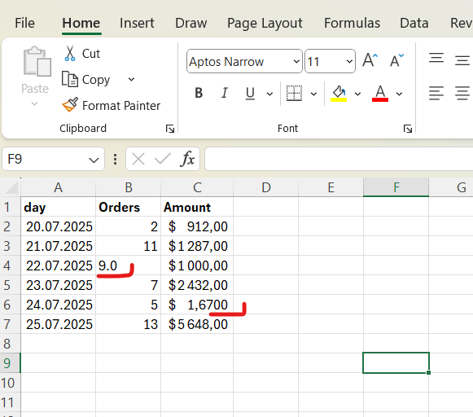

In Excel, pressing Alt + F11 will open the VBA editor. To find the code that was saved while recording the previous macro, find the folder where you saved it – for example, Personal. Then, right-click on the module -> view code. A window with the VBA code will appear. It will record all the clicks and actions performed from the beginning to the end of the recording. In my case, the code looks like this, showing the functions I created one by one. I selected the range (range selection), then bolded the font, then selected column A, then changed the format to "m/d/yyyy," then selected column B, changed various formats, and finally settled on "0," etc. The assigned shortcut to the code is visible at the top. The whole thing is quite messy because, although I tried to make as few clicks as possible, Excel recorded everything. Writing code from scratch in VBA is considered preferable because it's clearer and easier to make changes. But I will write about this in the next chapter.

The next macro I'll record will add a header for the entire sheet in column A1, with the Amount total in the cell below it, the Amount average next to it, and the number of orders in cell C1. Theoretically, we could do all of this in a single macro, but I recommend breaking it down into smaller steps, as it's easier to use the macro we need in a given situation. If we need all of them, we'll use three keyboard shortcuts for each, which takes seconds. I'll also add an action to capitalize all letters (UPPER) and remove unnecessary spaces throughout the sheet (TRIM). I'll also add a Find and Replace function to find and replace periods with commas in column B.

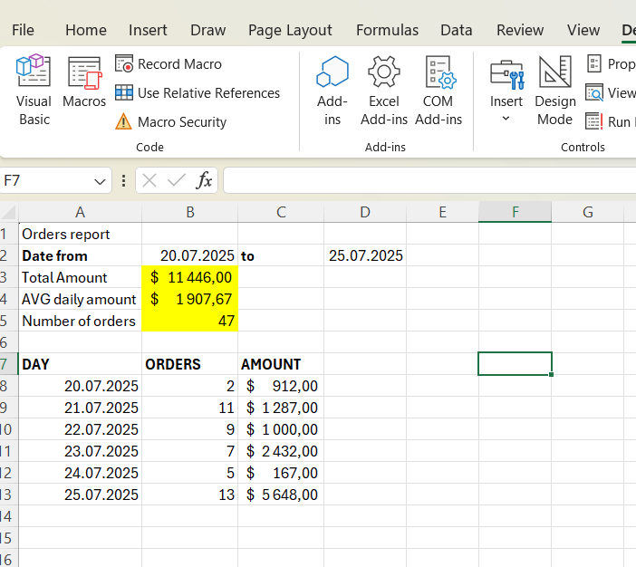

This time, the macro I recorded had a lot of functionality. Each time I used TRIM, I had to enter the formula in a different cell, enter the range, then paste it into a specific location, like column B, and finally convert it back to numbers. That's why the code is so long.

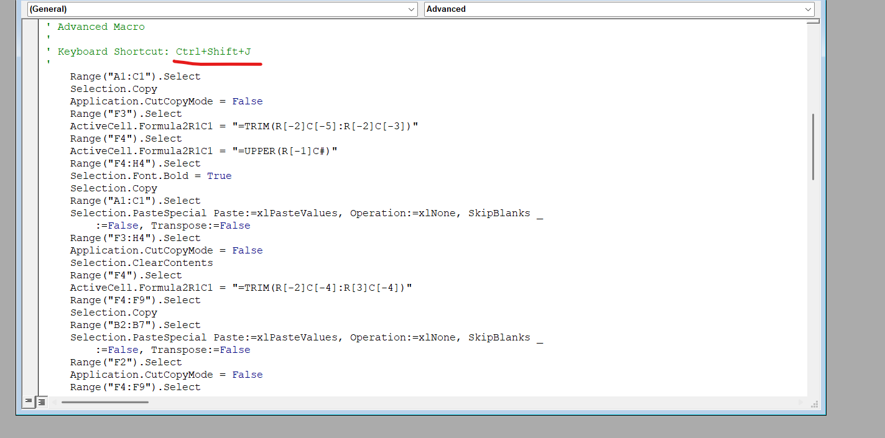

The last macro I'll record will create a sales chart by day, a chart of order counts, zoom and center the "Orders Report" title, and add a MIN/MAX Amount. As you can see, macros can make work much easier; we've made quite a few improvements in just a few seconds. The biggest drawback of recorded macros is that they only work on a specific range. Therefore, if the data becomes longer, the columns are set differently, or if we import data into Excel starting from A2 instead of A1, the entire operation will be invalid. Therefore, this type of macro is best used when we're sure the data we receive is always in the same format, or only for visual purposes. Not everything can be done with this type of recorded macro; for more complex tasks, code written in VBA will be required.

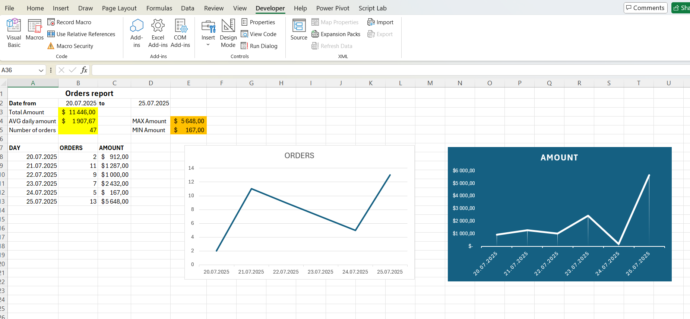

When it comes to macros written in VBA, we're truly limited only by our imagination and needs. Writing the code ourselves allows us to completely customize Excel's behavior. This feature is less frequently used these days, but macros can still speed up and simplify work. Paradoxically, macros are often used by people who lack Excel knowledge – someone else prepares the macros and then simply writes down "if you want to achieve this and that, select this and that and press a specific combination."

In the previous recorded macro, I had Excel automatically determine the largest and smallest values in the table. However, as I mentioned, if the table range were larger or if we wanted to extract only a specific section, the macro wouldn't work properly. A much better solution is a macro that operates on the area we select. The code below is ready to be pasted into VBA. Simply press Alt + F11, right-click in the folder where you want to add the macro, e.g., Personal, and select View Code. A window will appear with all the codes written so far.

The initial command is always Sub, followed by the macro name. Then comes the "Dim" code block, which defines the variables we'll use later in the code. Dim stands for Dimension. The next code block is an if loop, which checks whether the user-selected range is actually a cell selection and not, for example, a chart.

     If TypeName(Selection) <> "Range" Then

The <> sign means "different from." If it's something else, the macro will display the message "Please select a range of cells before running the macro." and exit (Exit Sub). The next step sets the selection as the user-selected range, and first is assigned True, just to make it easier to control the code later.

    Set selectedRange = Selection
    first = True

Then comes the meat of the code: the If…Then… code iterates through each cell, first checking if it's empty and if it's a number (isnumeric, isempty). It sets the encountered cells to min and max = (the first two), and then changes the previously specified first to False to avoid repeating this process every time. It then compares each subsequent cell to the previous one and updates the value if it's greater or less. Finally, there's a piece of code that assigns a color to MIN and MAX.

    For Each cell In selectedRange
        If IsNumeric(cell.Value) And Not IsEmpty(cell.Value) Then
            If cell.Value = minVal Then
                cell.Interior.Color = RGB(255, 100, 100)
            ElseIf cell.Value = maxVal Then
                cell.Interior.Color = RGB(100, 255, 100)
            End If
        End If
    Next cell

This is a very useful macro because it works on a range that we select ourselves, so we can select 3 cells and choose values from them, or we can select 50 and it will work the same way.

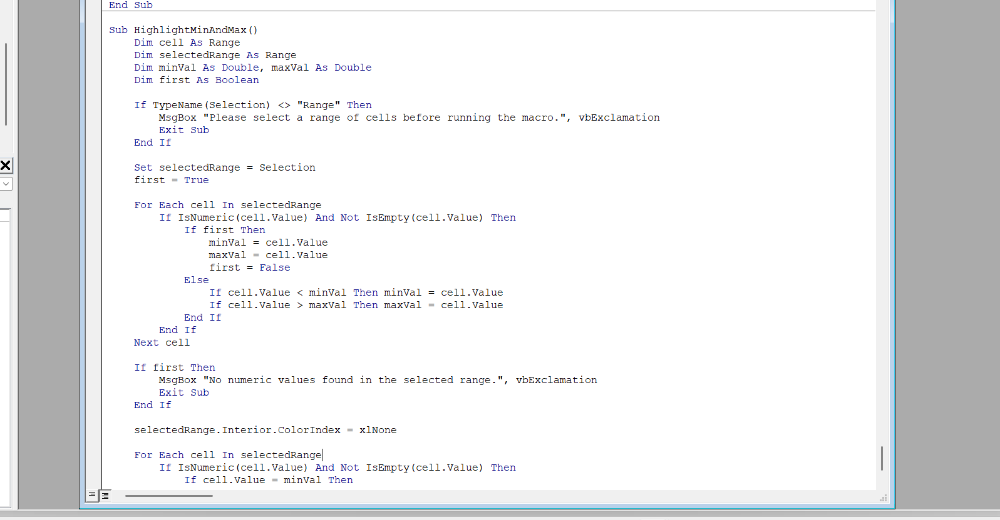

When creating a macro with VBA code, we can't specify the shortcut at the beginning. We can do this later, from Excel Developer -> Macros -> Options or (Alt + F8) and make changes. The next action I'd like to present is something very useful for a full report: a forecast for the next 5 days. However, I'll break it down into two macros. The first macro adds 5 days to the date of the last row after the one selected. The code is presented below. The beginning is the same as in the macros we've already seen. First, we define variables -> Dim and use an if loop if a range hasn't been selected. Set rng = Selection assigns a value to the selected range. Then, using Set lastCell = rng.Cells(rng.Cells.Count), we count the cells from top to bottom and determine which is the last one (Cells.Count). Next, there's the If IsDate(lastCell.Value) Then cell, which checks whether the last cell (lastCell) contains a valid date.

If yes, assigns this date to the lastDate variable.
If not (e.g., empty cell, text, etc.), uses today's date (Date).

Finally, the for loop goes through the entire process 5 times and adds 5 dates.

      For i = 1 To 5
          lastCell.Offset(i, 0).Value = lastDate + i
      Next i

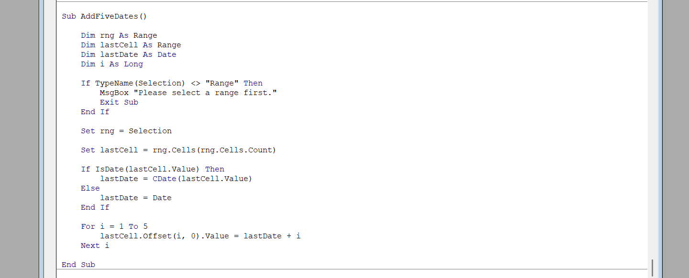

The last macro I'd like to add is a FORECAST.ETS forecast macro. In this case, we can also select the area in which we want to make the forecast. The beginning of the code is almost identical to the previous examples – the function name, variable descriptions, and then targetcol = 3, which simply designates the column in which the forecast results should appear. The IF condition, as in the previous example, checks whether the cell contains a date.

    For i = 1 To 5
        Dim targetRow As Long
        targetRow = lastCell.Row + i
       
        lastCell.Offset(i, 0).Value = lastDate + i
       
        Cells(targetRow, targetCol).Formula = "=FORECAST.ETS(A" & targetRow & ", C8:C13, A8:A13)"
    Next i

This is the heart of this macro, where the most important thing is to specify how far the macro should extend. This is done by the for loop i = 1 to 5. In this example, lastcell is the reference point, and Offset is the offset. (i,0) is the command to move from the current cell by the value i = first 1, then 2, then 3, etc., and 0 cells to the side.

The code Cells(targetRow, targetCol) only indicates which cell the FORECAST.ETS function should be used from. That's why there's the letter A (column A) and immediately after it "TargetRow," giving us A14, A15, A16, etc.

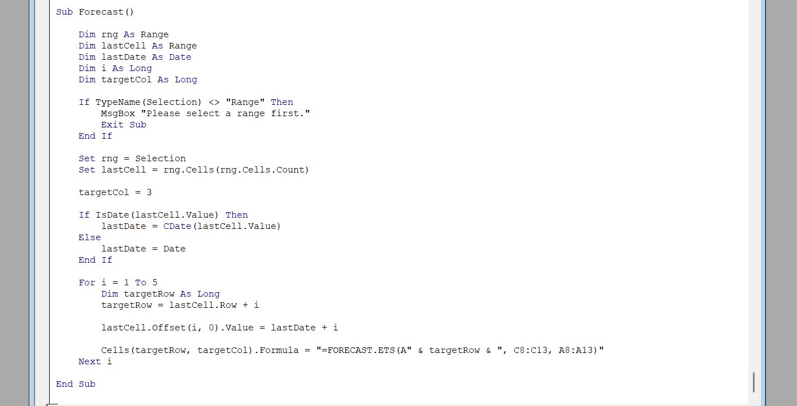

That was the last macro and the last function I wanted to present. Together, we'll take you on a long journey through Excel's key features. I hope you learned a lot and discovered new ways to streamline your work. Despite the development of many programs, Excel remains a great tool for various tasks. I hope the knowledge I've shared will be useful not only in your work but also in life :)

Finally, I'm adding a GIF showing the operation of all the macros I used in this chapter – from the initial data to the final forecast. All the best and good luck! :)

[Table of Contents](#table-of-contents)

